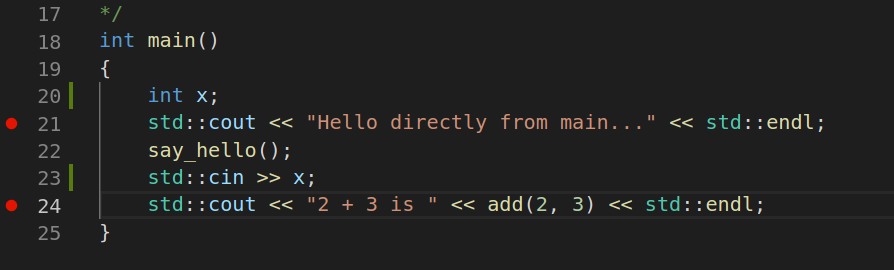
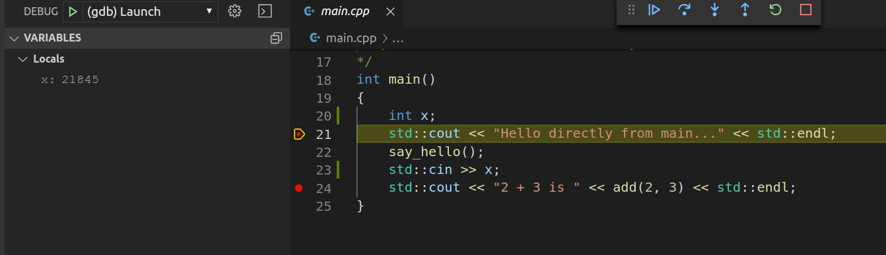
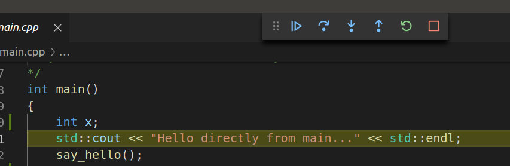

# Using a debugger
Debugging is the process of finding out why your program isn't working... and you'll need to get very good at this if you want to be a software developer!

Debugging usually falls into two broad categories:
1. Carefully placed print statements
2. Usage of a debugger to inspect code step by step.

Although it's common to make fun of just using print statements to see where your code is going wrong, you'd be surprised just how far that will take you.  Print outs are often a very good way to get a rough idea of where your program is crashing, or otherwise going wrong.  There are some situations where print outs just don't reveal the problem readily however - **and so it's wise to get accustomed to using a debugger**.

For those of you who have used Visual Studio in previous courses, you may already be familiar with launching your program through the Debug menu, and setting breakpoints.  Visual Studio has an integrated debugger.

In our programming environment, we need to use an independent debugger - called `gdb`.  `gdb` is widely used, and can be integrated into common development environments, *like Visual Studio Code*.

`gdb` will allow you to set break points, and inspect the values of variables while stepping through your program line by line.

## Building for Debugging
For any debugger to work, the executable program being inspected must be built with debugging flags enabled.  This is what allows the debugger to match up binary executable instructions with lines of source code.

In our environment, this is controlled by `cmake`.  In order to build your executable to allow debugging, you **must execute `cmake` with an extra flag:**

```
cmake -DCMAKE_BUILD_TYPE=Debug ..
```

If you find yourself using a debugger often, you probably just want to start of always using the above command.  You continue to use `make` the same way as before.

## Integrating GDB with Visual Studio
You can run `gdb` directly from the command line, but it's not the most user friendly setup.  A much better experience is had if you run the debugger through Visual Studio Code.

### Setting up under Windows (Cygwin)
First you will need to setup VSCode such that it uses Cygwin as the terminal.  By default, it uses the Windows build in console, which is inadequate.

Select "File" and then "Preferences", and then "Settings" to open the configuration editor.  towards the top, select "Workspace" rather than "User".  Then, at the top right, click the icon (left-most) to open the JSON editor.

Add the following within the top level `{` `}` braces:
```
 "terminal.integrated.shell.windows": "<full path to Cygwin>\\bin\\bash.exe",
    "terminal.integrated.env.windows": {
        "CHERE_INVOKING": "1"
    },
    "terminal.integrated.shellArgs.windows": [
        "--login",
        "-i"
    ],
```
Be sure to edit the path to Cygwin to match your machine's setup.  Save the settings.

Next, Select "Debug" and then "Open Configurations" from the top menu.  This creates a default `launch.json` file, which you will need to edit.

Edit your file such that it looks like this:

```
{
    "version": "0.2.0",
    "configurations": [
        {
            "name": "(gdb) Launch",
            "type": "cppdbg",
            "request": "launch",
            "program": "${workspaceFolder}/<path to your executable>",
            "args": [],
            "stopAtEntry": true,
            "cwd": "${workspaceFolder}",
            "environment": [],
            "externalConsole": true,
            "MIMode": "gdb",
            "setupCommands": [
                {
                    "description": "Enable pretty-printing for gdb",
                    "text": "-enable-pretty-printing",
                    "ignoreFailures": true
                }
            ]
        }
    ]
}
```

Specifically, you will need to edit the `program` field, making it the exact path to your executable you wish to debug. You will also need to set `stopAtentry` and `externalConsole` to `true`.

Save the file, close Visual Studio Code, and then re-open.  You will now be able to launch your debugger.

### Setting up under Mac OS and Linux
*Note, rather than GDB from Windows and Linux, on a Mac you will use a program called `lldb` - which is exactly the same*.

Within VSCode, select "Debug" and "Open Configurations".  Choose "C++ (GDB/LLDB)" from the choice list.  Then choose "Default Configuration"

This should create a default `launch.json` file, which you should edit to look like the following:

```
{
    "version": "0.2.0",
    "configurations": [
        {
            "name": "(lldb) Launch",
            "type": "cppdbg",
            "request": "launch",
            "program": "{workspaceFolder}/build/starting",
            "args": [],
            "stopAtEntry": false,
            "cwd": "${workspaceFolder}",
            "environment": [],
            "externalConsole": false,
            "MIMode": "lldb"
        }
    ]
}
```
In particular, edit `program` to point to the executable you are building and debugging.  If user input is required by your program, I recommmend you set `externaleConsole` to `true` as well.


## Using the debugger
With everything set up properly, you can select "Debug' and "Start Debugging".  Just remember that each time you start a new project, you need to ensure your `launch.json` file is pointing to the correct executable, and that the executable was build with debugging flags (see above).

### Breakpoints
Breakpoints tell the debugger to pause execution.  **Important** you must set your break points **before** building the program using `make`.  Each time you change break points, you **must** `make clean` and `make`.  Otherwise, `gdb` will not honor them.

To set a breakpoint, simply click the left margin next to your code.  A red circle will appear, which indicates the break point is set.



### Variable Inspection

When you run your program from the Debug menu, execution will halt at your break point.  The Debug window (left side) will display variables in scope, and allow you to enter "watch" expressions for inspection.



### Stepping through your code
You may use the top button bar to step through your code, run to the next breakpoint, or terminate it entirely.



More information can be found [here](https://code.visualstudio.com/docs/cpp/cpp-debug) and [here](https://code.visualstudio.com/docs/editor/debugging)

