# Our Development Environment
Our code environment is designed to be as similar as possible on all three major operating systems - Windows, MacOS, and Linux.  It is also designed to get you more accustomed to very popular software development tools used in industry.  No matter which OS you are using, I'm going to have you working from the command line (terminal) a fair amount, and using simple file-based tools rather than large integrated devleopment environments (IDEs) like Visual Studio, XCode, and Eclipse.

Please see additional details in the course lecture slides.  Here is an outline of the tools you will need to install:

- **Cygwin** - a tool for bringing POSIX-compliant OS features to Windows
- `git` - a tool for getting code, and sharing code
- `clang` or `g++` - a C++ compiler
- `make` - a tool for invoking `clang` or `g++` to build multi-file programs.
- `cmake` - a tool for configuring your project such that you can use `make`!
-  A code editor - I'll by using VSCode (Visual Studio Code), but other alternatives would be Sublime Text, Atom, and Notepad ++ (Windows).  I do recommend VSCode however.

## Tips for setting up your environment.
I cannot stress enough how important it is, as a software developer, **to read instructions carefully**.  Too many students, and professional developers, breeze through instructions, not reading carefully, executing install steps / commands without actually reading descriptions and prompts.  **It almost always results in mistakes**, which in a professional environment are *embarrasing* - because it makes it obvious you did not care enough about setting your machine up to warrant *reading*.  It's a wonderful way to leave an awful first impression. **Please get out of that habit** - read this document carefully.

**Sometimes installs go bad - and I will help you.**  *However, if it's clear to me that you simply didn't read, I won't help - I'll just tell you to read!*.

## Why Cygwin?
The Windows operating system is *vastly* different than Linux and Mac OS - but wonderfuly capable of supporting C++ in its own right.  *However* - we will **not** use the most typical setup on Windows.

**Windows is a perfectly viable operating system for software development** - however it is so distinct from Linux and MacOS, that if you stay in Windows for too long, you will grow resistant to learning other platforms.  This is particularly dangerous for someone just starting out.  Linux (and MacOS, by way of its similarities to Linux) are the platforms of choice for many, many modern development shops - in particular among those doing web development and using cloud-based infrastructure.  **It is imperative** to your professional success to feel comfortable on these systems -  and getting familiar with using Cygwin is one method of doing so.

Alternative, you could also use Windows Subsystem for Linux, which is a newer method os working with a Linux-like environment under Windows, and one that Microsoft has officially developed.  You could also install Linux in a virtual machine, or even dual-boot your machine.  *I am not recommending these paths*, only because the setup is a bit more difficult - but if you want to try these paths - **please feel free to do so**, and check out the [Linux instructions](dev-setup-linux.html) to set your code environment up once you have a working Linux environment.

## What about Visual Studio?
You may have already done C++ development on Windows in Visual Studio.  Visual Studio should not be confused with VSCode - which is a lightweight, cross-platform code editor.  Visual Studio (proper) is a full blown Integrated Development Environment and contains Microsoft's proprietary C++ compiler.  Visual Studio is great - **however** - you need to be able to develop in a variety of environments if you want to be a professional developer.  Moreover - as you switch to different operating systems, Visual Studio is no longer an option for you - which puts you at a distinct disadvantage.  *I strongly encourage you to get comfortable with developing with CMake, clang/g++ using Cygwin on Windows - as described above*.  By getting out of your comfort zone, you will learn a lot, and become a much more effective programmer.

Note - **CMake can work natively on Windows**.  CMake can also utilize Visual Studio to build C++ code, rather than `make` and `g++`, which you would normally use on Linux / Mac OS / Cygwin.  This is the beauty of CMake - it works with almost anything.  **If you already have a fully functioning Visual Studio C++ environment set up**, then feel free to install CMake directly on Windows.  You will be able to build all source code using just like in all of the rest of the examples (i.e. `cmake`).  Google will be your best friend here.  **If you have not used Visual Studio** before, don't go this route however - use Cygwin, as described above.

## But really, can I just use Visual Studio?
Go right ahead.  Just remember - you need to submit CMakeLists.txt with most of your assignments.  You **will** need to understand CMake, you **will** need to understand how to use the commands to create project files, build executables, and launch tests.  If you learn all that, but still secretly using Visual Studio - I wish you all the best :)

# Installation

**Note:**  You **must** have Administrator access on your machine.

## Code Editor - VS Code
Go to [https://code.visualstudio.com](code.visualstudio.com) and download Visual Studio Code for Windows.  **As discussed before - Visual Studio Code is NOT Visual Studio** - please make sure you understand the difference.

Install Visual Studio code using all the default options.  When you arrive at the "Select Additional Tasks", I recommend that you also check off the "Open with Code" actions under "Other" for convenience.


## Cygwin
Cygwin is a program that allows you to run programs commonly found on the Linux operating system, on Windows.  After installing, you will do all of your work under Cygwin (builing/compiling/executing programs).  **It is extremely critical that you follow the instructions below precisely**.

Download Cygwin using the following link:  [https://www.cygwin.com/setup-x86_64.exe](https://www.cygwin.com/setup-x86_64.exe).

After downloading the installer, run it - and follow the instructions as outline below:

### Initialization
Launch the setup.
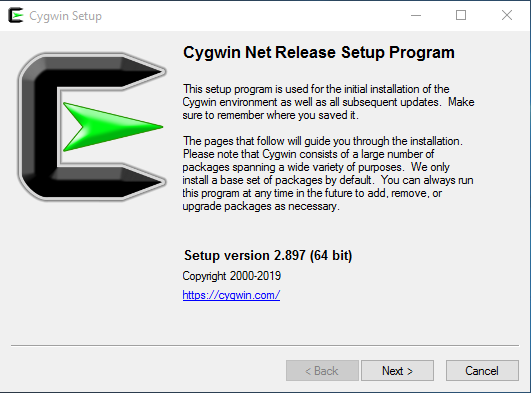

Choose to download the rest of the application from the internet

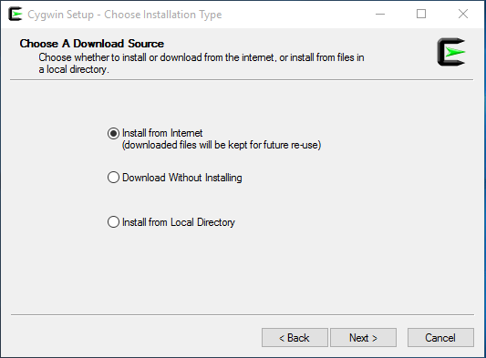

Cygwin is really just a set of programs, that work like their Linux counterparts, but run on Windows - through the Cygwin terminal environment.  Importantly, Cygwin does not "live" in a separate area of your computer though - it uses the same folders as Windows, and you can open and edit files that you work with under Cygwin using programs installed right on Windows too.

By default, Cygwin assumes that the "root" of your Cygwn file system is located at `C:\cygwin64`.  

Leave the default, as `C:\cygwin64`
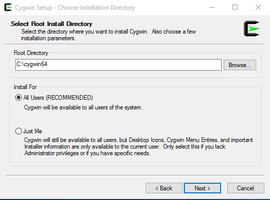

Keep the default for your Local Package Directory - this isn't all that important.

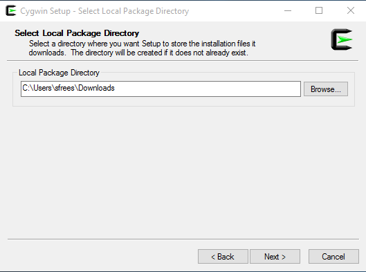

Keep the default for internet settings.

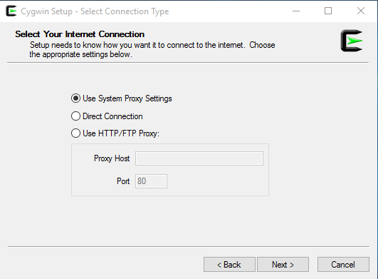

Choose the download site - where Cygwin will download the programs we need from.  It doesn't really matter where you choose - but it is wise to pick something near you, and that likely has a good fast connection.


### Package Selection (IMPORTANT!)
The MOST important part of the setup is choosing the packages (programs) you need.  We need to install the following:

1. git
2. g++
3. make
4. cmake

#### Package 1:  Select git
Enter "git" in the search box towards the top left.  Expand the package list tree, so you can see the "Devel" tree, and change the entry for **git** to 2.17 instead of "Skip".  **DO NOT CLICK NEXT YET**.
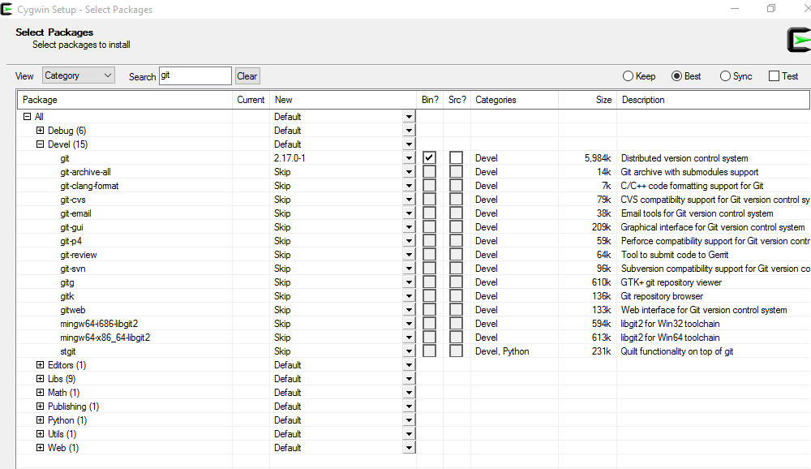

Now, `git` is queued for install, but we need to install the rest.  

#### Package 2:  Select g++
Next, type `g++` into the search box.  Change the **gcc-g++** line from "Skip" to version 7.4 or above.  **DO NOT CLICK NEXT YET**.

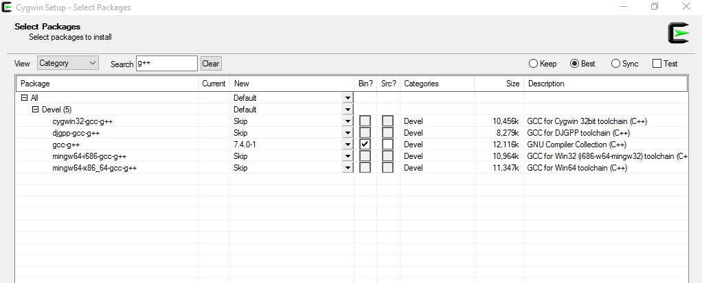

#### Package 3 and 4:  Select make and cmake
Now, type `make` in the search box.  Change the **make** line to version 4.2 or above, and the **cmake** line to version 3.6 or above (the search term "make" finds both the `make` and `cmake` terms).

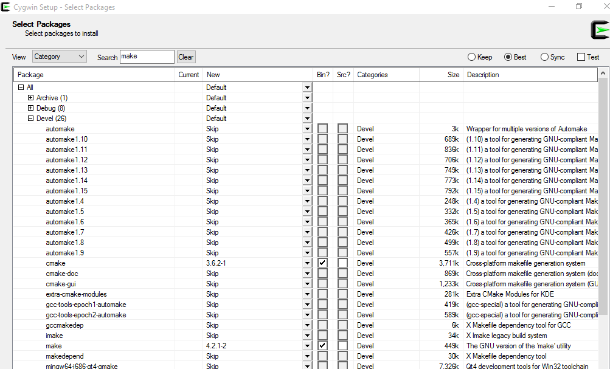

Now **Click next**, you should see a confirmation screen - where **many** packages will be listed - they are dependencies of what we selected ourselves.  

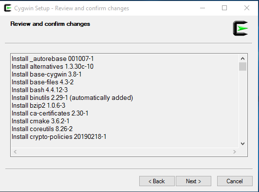

Click next, and Cygwin will begin installing.  This step will take a while, and you can leave it running unattended.

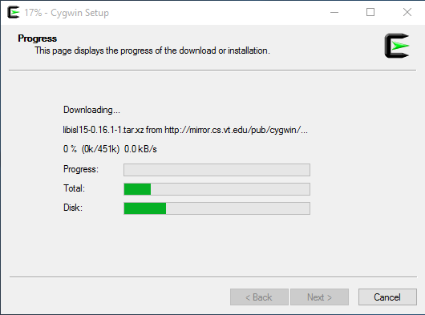

When it completes, be sure to keep the defaults as specified, so Cygwin is easy for you to launch - you will be using it all semester!

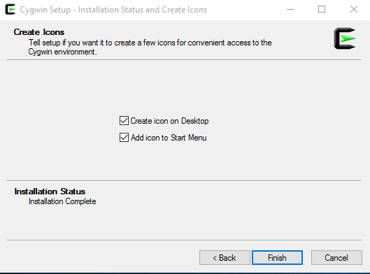

When the installer complete, Cygwin Terminal should be on your Desktop.
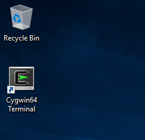

**IMPORTANT**:   From this point forward, all of the work you do on a command line (building programs) **must** be done in the Cygwin terminal - not the standard Windows Command Prompt.  

# Verifying your setup
## Launch Cygwin
Double click Cygwin to open the terminal.  It looks a lot like the normal Windows command prompt - **but it is not** - it is a UNIX-like system.
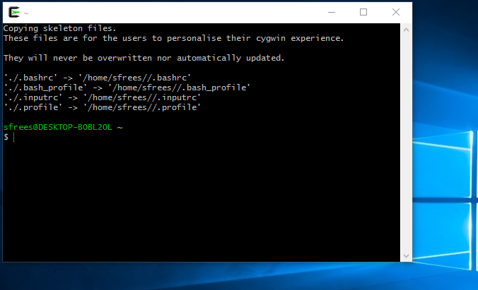

## Getting the course code
You can do this by downloading the course repository, and building/executing the first project - `/code/01-getting-started`.

**From within Cygwin,** create a directory on your machine where you want to put most of your development work, for example, `~/projects`.

```
$ mkdir ~/projects
$ cd ~/projects
```
Then, clone the course repository
```
$ git clone https://github.com/scottfrees/cmps231.git
```

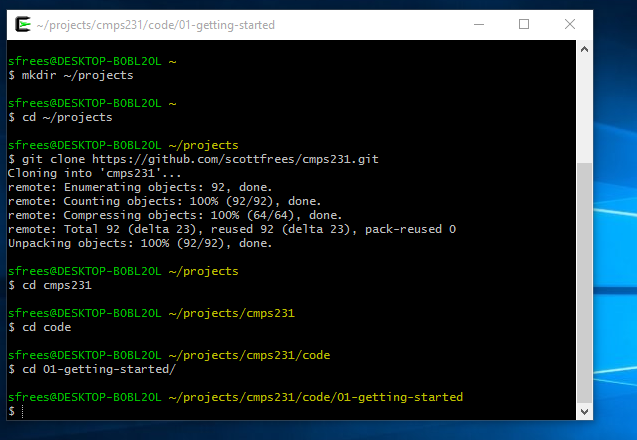

Move into the code directory, and then the first project, where you should see 3 files and a directory:
```
$ cd cmps231/code
$ cd 01-getting-started
$ ls 
CmakeLists.txt  includes  main.cpp    test.cpp
```

## Build some code
Build the project by creating a `build` directory, moving into it, and executing `cmake`

```
$ mkdir build
$ cd build
$ cmake ..
```
That should kick off a bit of a process, since it's the first time `cmake` might be run.  Future times you invoke `cmake` will not require as much time.  At the end, you should see a message like "Build files have been written to..."

Build the *executabe* using `make`.

```
$ make
```

Remember that `make` is what actually compiles your code - `cmake` creates files that `make` uses to know how to do this.  When updating code, you simply use `make` to recompile.  You only need to run `cmake` when you add/remove/rename source code files!

Execute your program:

```
$ ./starting
Hello directly from main...
Hello from the hello file...
2 + 3 is 5
```

### Making code changes
Now is a good time to make a change.  **From normal Windows**, open Visual Studio Code and select "File", and then "Open Folder".  Find the `01-getting-started` directory, which will be under the following chain of directories:

1. `C:\` drive
2. cywin64
3. home
4. your username
5. projects

From `projects`, you can find the `01-getting-started` directory by looking through the `cmps231` folder itself.

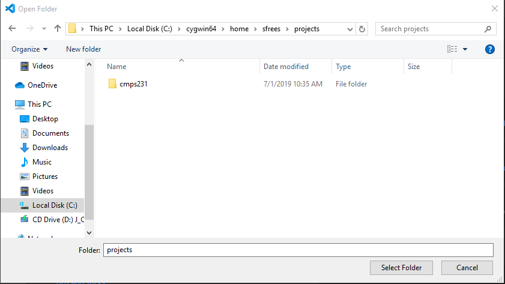

Make a change to the source code (maybe add another `cout` statement to main.cpp).  Save your changes **and return to the Cygwin terminal**.  

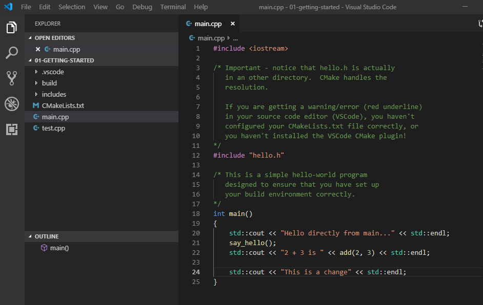


Recompile with `make`, and re-run by typing `./starting` again - **you should see the effects of your changes**.

```
$ make
$ ./starting
```

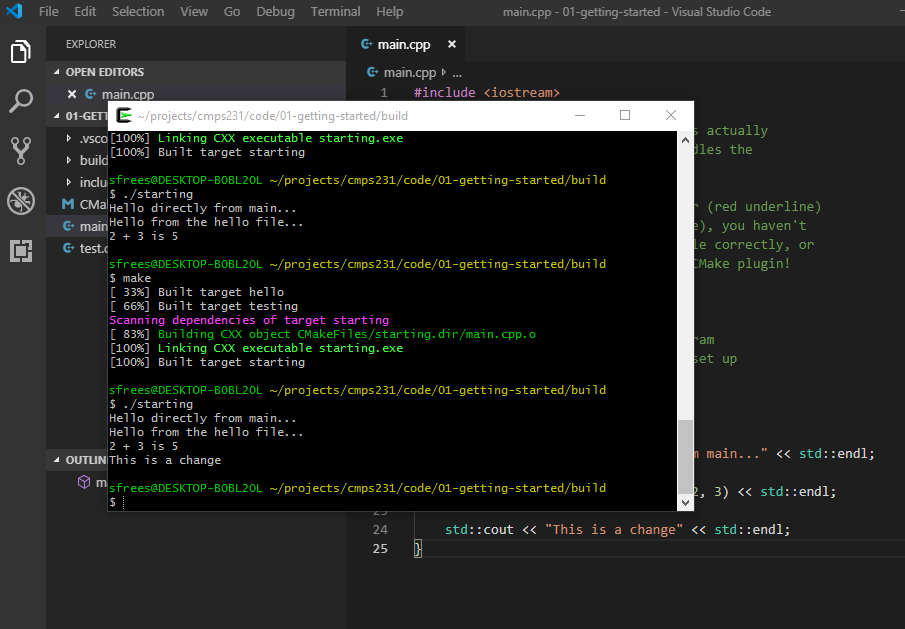

# Where to put your own work
I have two recommendations:

1. Create a directory **within** the course repository, `/code/work`.  Whenever you are doing labs, assignments, etc, put your projects in the `work` directory.
2. ... or ... create a separate directory, somewhere else **under the `C:\cygwin64\home\username\project`** directory.  It is **absolutely crucial** that you put all code within the Cygwin environment - which lives withing `C:\cygwin64\home\username` - otherwise it is inaccessible from Cygwin terminal.


