title: Binary Search Trees
---
class: center, middle, inverse
# Binary Search Trees

---
# Requirements for binary search?
We've proven a binary search can run in log<sub>n</sub> time... *however*.
- The algorithm only works on a sorted list.
- **Adding** into a sorted list requires an O(n) search to find correct location.
- **Adding N numbers, one-by-one** is thus an O(n<sup>2</sup>) operation!
- **Plus**, we can't really use a `list` because we need **random access**.

.callout[
If we have pre-sorted array or vector, binary search works great.  Otherwise, building the list is time consuming - killing search benefit.
]

---
# Search Tree
The solution to the problem is a data structure that borrows some ideas from *linked list*, but is designed for **searching**.

A **Binary Search Tree** will support rapid `add`, `remove`, and `search`.


---
# Root Node
- The **root** node is the "beginning" of the tree - it is a `node` with a pointer to the `left` and `right` side.  
- There is no requirement that there is an equal number of values in left / right - the requirements is value-based

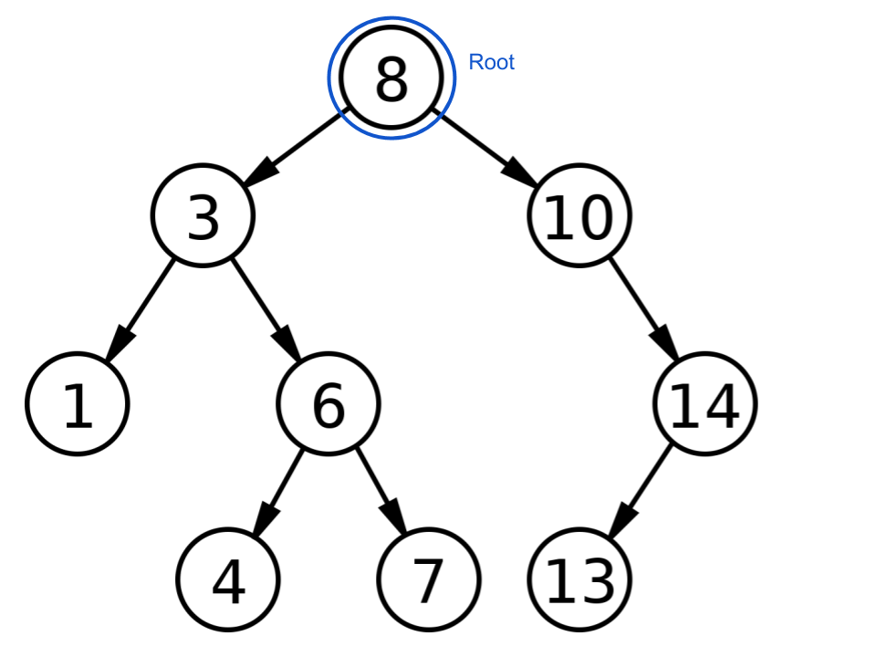

---
# Left / Right Children
- Each `node` has a left and right child - which is the **root** of another tree.  
- All values in the left tree are less than the root, all values to the right are greater.

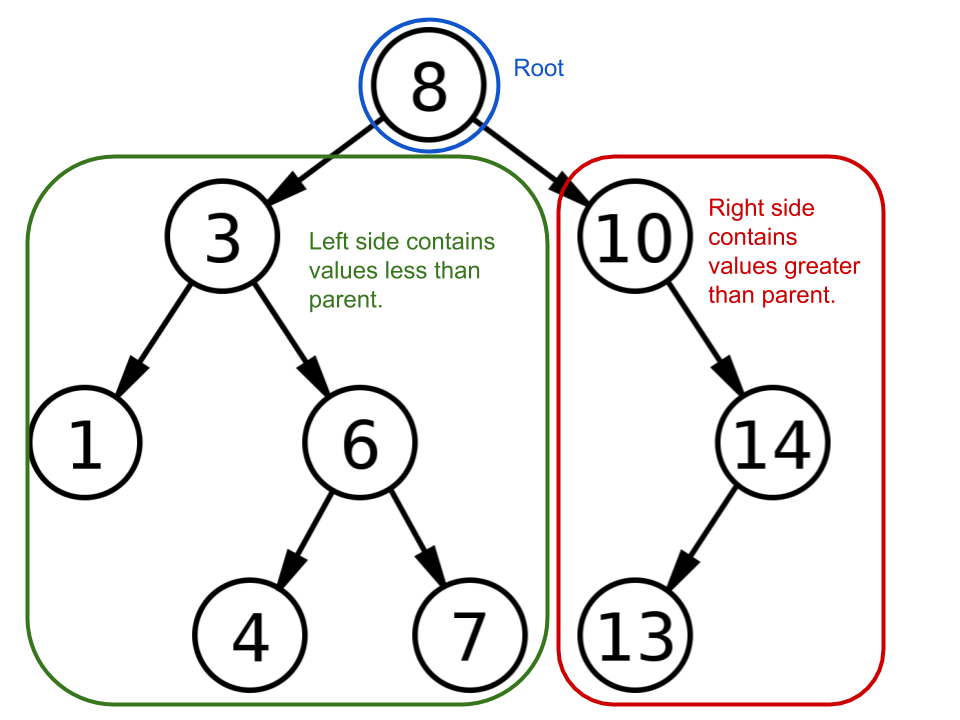

---
# Recursive Definition
- A tree is a **root node**, which has a tree on it's left whose values are less than it, and a tree on the right whose values are greater.  
- *A tree can also be empty*.

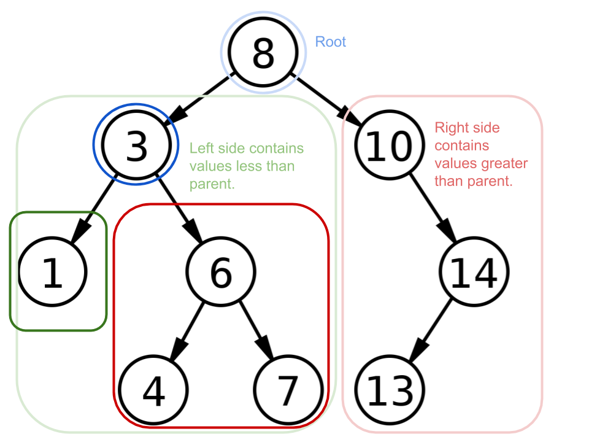

---
# Recursive Definition
- A tree is a **root node**, which has a tree on it's left whose values are less than it, and a tree on the right whose values are greater.  
- *A tree can also be empty*.


---
# Implementation:  Insert
We can define insertion as recursive idea:
- If the tree is empty, create a new node with the value, and left and right sides as `nullptr`
- If the tree's root is the value you are inserting - done (no duplicates)
- If the tree's root is **less than** the value inserting, **add to right hand side tree**.
- If the tree's root is **greater**, then **add to left side**.

---
# Implementation:  Find
We can implement `find` the same way...
- If the root is null, return `false`.
- If the root has the value we are looking for, return `true`.
- If the tree's root is **less than** the value inserting, **search the  right hand side tree**.
- If the tree's root is **greater**, then **search the left side**.
---
# Container implementation
We will have a `node` class - just like in `LinkedList`.
```c++
class node {
    public:
        node(node *left, node*right, int value);

        node * left;
        node * right;
        int value;
}
```

---
# Container implementation
Our `BSTree` class implements our methods:
```c++
class BSTree {
    public:
        BSTree(); // initialize to empty
        void insert(int value);
        bool find(int value);
        // ... more to come
    private:
        node * root;
}
```

* Note - a `BSTree` is not like a `list`, it is **not** a sequence container - it controls the order of values.

.callout[
Let's implement the `insert` and `find` methods.
]

---
# Does it work?
.split-left[

]
.split-right[
- Well... we can test the `find` method relatively well...
- But we aren't really testing **structure**.
- **Idea**:  Use an auxiliary structure to allow **iteration** across the tree, revealing it's structure.
]

---
# Breadth-first vs. Depth-first

.callout[
Either of these could be used for testing purposes, let's implement depth-first for now, and if we have time we'll look at breadth-first.
]

---
# Implementing Depth-first traveral

---
# Removal?
Removal is... *tricky*
- We need to ensure that the structure and ordering rules of the tree are preserved.
- **Step 1:** find the node containing the value to be completed.
- **Step 2:** "remove" the node:
  - If the node has no children - remove the node (update parent).
  - If the node has one child, then the child (root) gets pulled upwards, replacing the node to delete.
  - If the node has **two children**, we must find the **least** value on the right side, and pull it up to replace the node to delete..

.callout[
Case 2 is the most interesting - why are we doing this?
]

---
# Case 1 - One Child

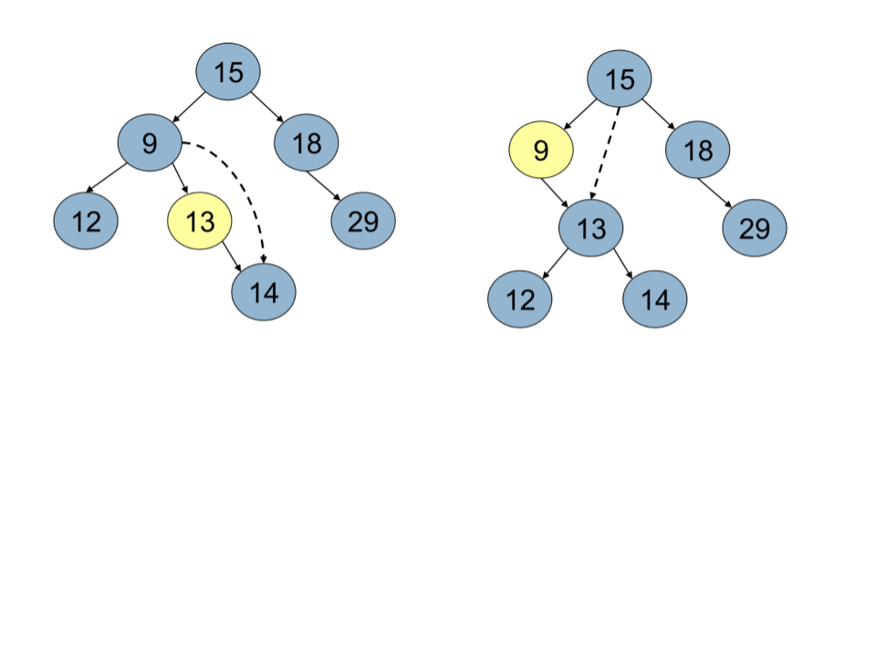

---
# Case 2 - Two Childre

.split-left[
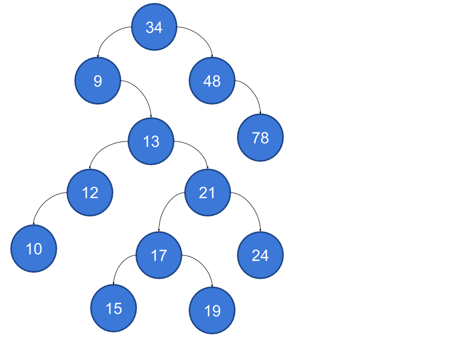
]
.split-right[
- Let's delete 13... it's unlucky anyway.
- The minimum of the right side is a suitable node to replace the deleted node - as it is *greater* than anything on the left, and clearly *less* than anything remaining on right.
]

---
# Case 2 - Two Children

.split-left[
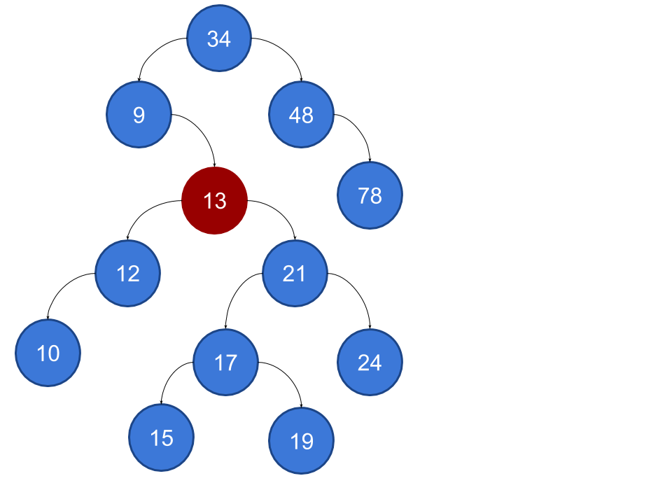
]
.split-right[
- Let's delete 13... it's unlucky anyway.
- The minimum of the right side is a suitable node to replace the deleted node - as it is *greater* than anything on the left, and clearly *less* than anything remaining on right.
]

---
# Case 2 - Two Children

.split-left[
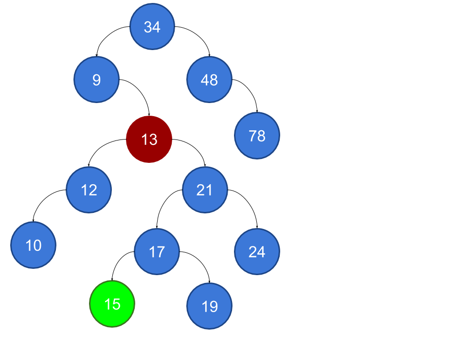
]
.split-right[
- Let's delete 13... it's unlucky anyway.
- The minimum of the right side is a suitable node to replace the deleted node - as it is *greater* than anything on the left, and clearly *less* than anything remaining on right.
]


---
# Case 2 - Two Children

.split-left[
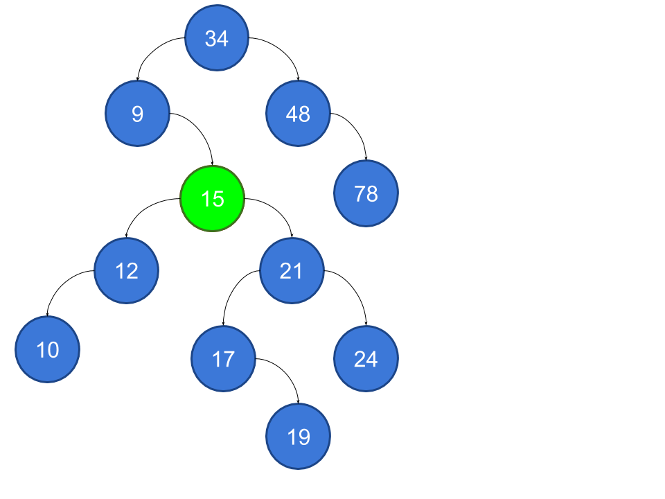
]
.split-right[
- Let's delete 13... it's unlucky anyway.
- The minimum of the right side is a suitable node to replace the deleted node - as it is *greater* than anything on the left, and clearly *less* than anything remaining on right.
]


---
# Case 2 - Two Children

.split-left[
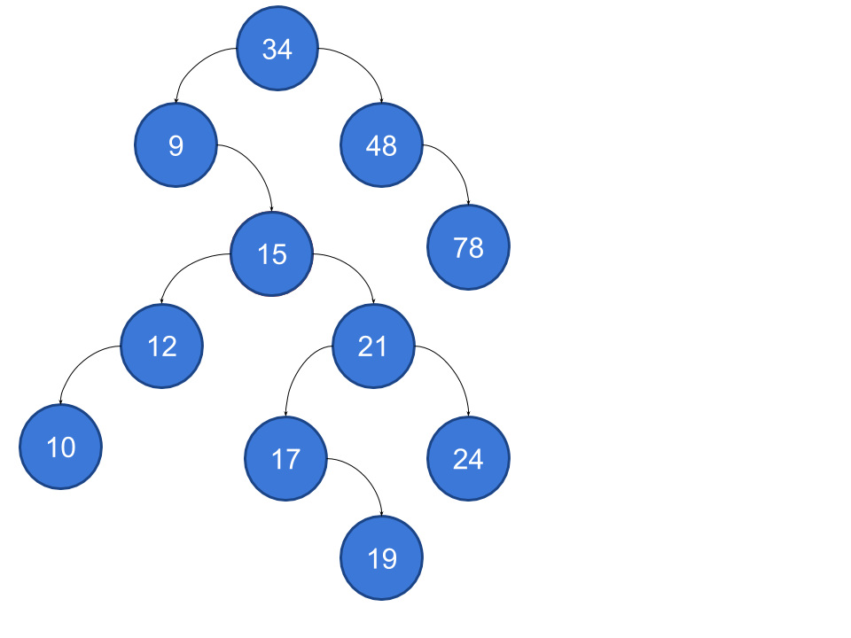
]
.split-right[
- Let's delete 13... it's unlucky anyway.
- The minimum of the right side is a suitable node to replace the deleted node - as it is *greater* than anything on the left, and clearly *less* than anything remaining on right.
]

---
# Implementing Remove

---
# How fast is find?
Find is *approximately* O(log<sub>n</sub>)...
- It is *approximate* because we don't know for sure that the tree is **balanced** - meaning we can't be sure the left and right side have the same number of values!
- A *balanced* tree has an equal **depth** to the left and right - **recursively**.
- A balanced tree provides superior performance - however...

.callout[
As it is now, the tree's balance is completely determined by the **order** of insertions!
]

---
# Balanced Tree

.split-left[
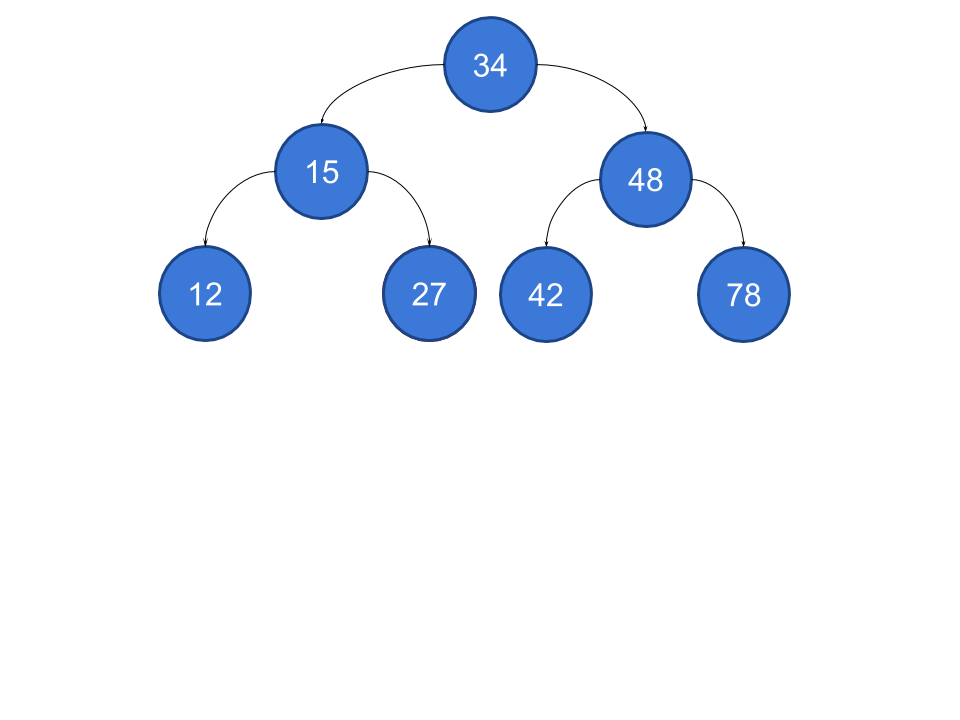
]
.split-right[
- What order of insertion would lead to this perfectly balanced tree?
]

---
# Un-Balanced Tree

.split-left[
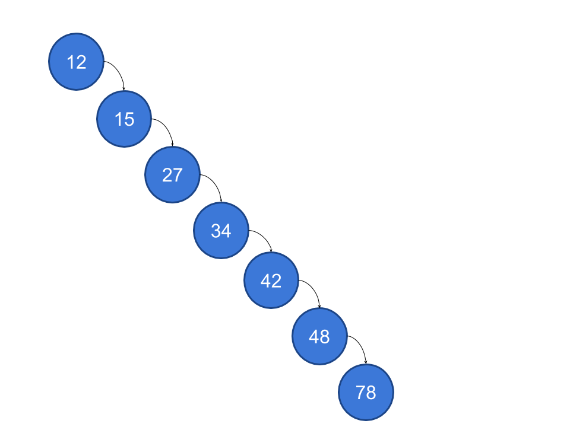
]
.split-right[
- What order of insertion would lead to this terribly balanced tree?
]

---
# Identifying Balance
- **depth** can be calculated - recursively.
 - `depth(node*n)`
  - If `node != nullptr`, return 1 + `max(depth(node->left), depth(node->right))`

- If the depth of `node->left` and `node->right` are equal, then the tree (rooted at `n`) is **balanced.

- **However**, we can't declare victory after looking at the root.

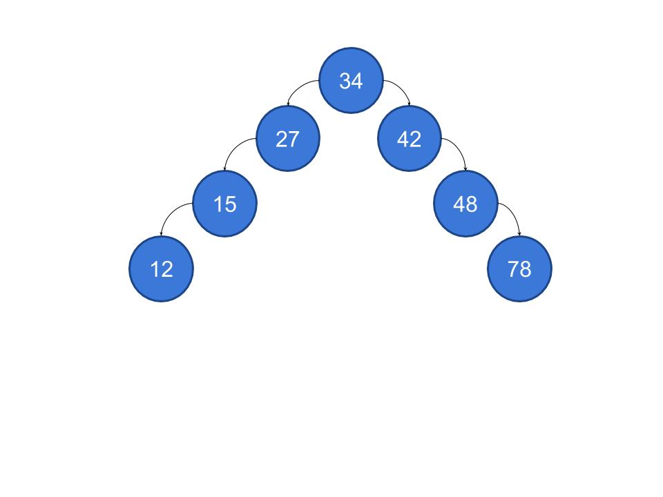

---
# "Well Balanced"
- A tree is **perfectly balanced** ,then **every** node is balanced.
- This isn't always possible - unless you've added a power of 2 values to the tree!
- A **well balanced** tree is a tree where every node's left/right depth is within one of each other.

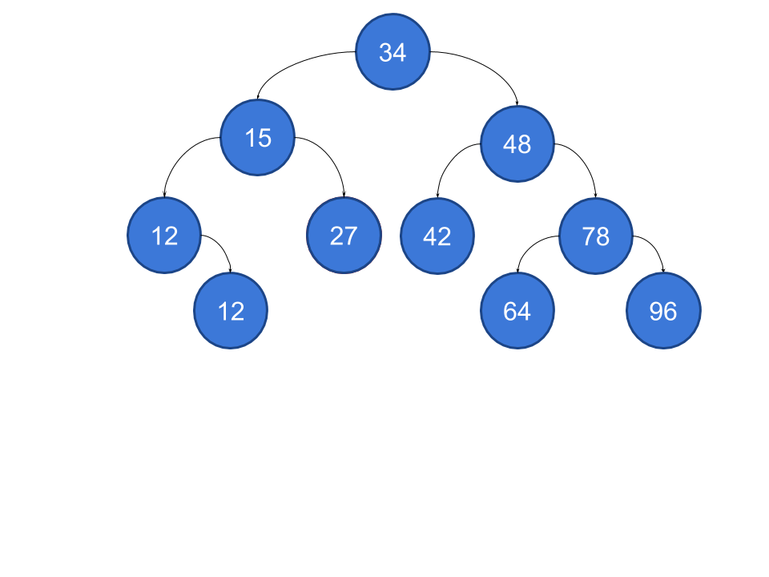

---
# AVL Trees
We actually have a specific name for this type of tree - **Adelson-Veleskii and Landis** tree - named after it's inventor.

```c++
bool is_avl(node *n) {
    if (!node ) return true;
    else if (abs(depth(n->left) - deth(n->right) > 1) {
        return false;
    } else {
        return is_avl(node->left) && is_avl(node-right);
    }
}
```

.callout[
- This is great... but how do we **ensure** the tree is AVL?  
- An AVL tree can become non-AVL after insert or remove.
]

---
# More cases!
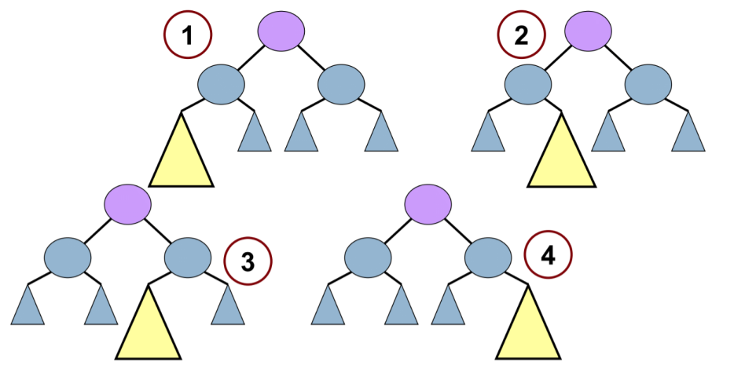

.callout[
- After insert/delete, we must find the **deepest** node that IS NOT AVL, and *attack it*.  
- Then we will repeat until all nodes are AVL
]


---
# Single rotation animations

---
# Double rotation animations


---
# Comparing List and BSTree

---
# Up next...
- Trees are a useful structure - and they don't need to always be for search!
- They also don't always need to be implemented as "linked" nodes - they can be stored in arrays too!