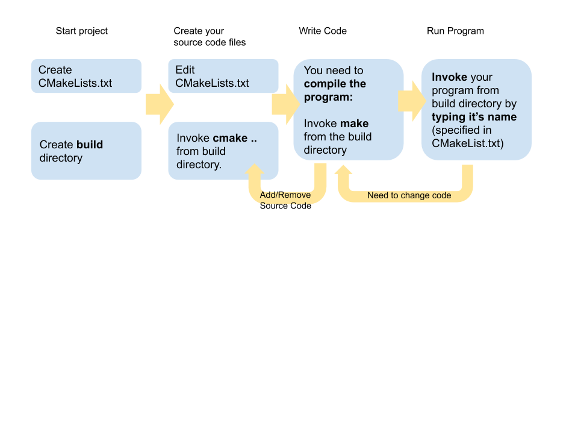

title: Development Environment
---
class: center, middle, inverse
# Our C++ Development Environment
---
# C++, Compilers, and Editors
- C++ is **cross-platform** - we can develop C++ on Windows, Linux, and MacOS.
- C++ source code must be *compiled* - and **compilers are platform specific**.
- C++ source code can be written using any editor - but you are probably familiar with a few larger **Integrated Development Environments** - for example Visual Studio.
---
# Compilers
Explain what a compiler is
---
# Compiling vs Linking
Explain linking is.
---
# Visual Studio
Explain what Visual Studio is...
---
# GNU Compiler
Explain what GNU is
---
# clang Compiler
Explain what clang is
---
# Configuration
- Configuring your build for `g++` and `clang` can be an intimidating task, especially if you are only familiar with Visual Studio.
- One of the most common tools used in the UNIX environment is `make` - which uses `Makefile`s to control how things are built and linked together.
- Two problems with `make`
 1. Doesn't work on Windows
 2. It is not a bit user friendly.
---
# Configuration with CMake
CMake is a tool to replace much of what `make` does in UNIX environments.
- CMake is *widely* used in industry
- CMake is completely cross platform
- CMake is *not* a compiler - it is a tool for telling your compile what to do!
- CMake is easy to get started with.
---
# Our Setup
- We will use `g++` or `clang`, along with CMake as our building tools.
- We will use Visual Studio Code (VSCode)
 - Please do not confuse VSCode with Visual Studio.  VSCode is **just a code editor**, it is not a integrated development environment.

This environment will work the same whether you use Windows, Mac OS, or Linux.
---
# Setting yourself up
**Windows** - The easiest path is to install Cygwin. 

**Mac OS** - You do not need Xcode, and if you haven't already installed it, I don't recommend that you do for this class.

**Linux** - The instructions for Linux are very straigtforward.

.callout[I have prepared **detailed instructions** for each platform [here](../code/readme.html)]

---

# Getting source code

.info[Git is a source version control system.  It's used *everywhere*.  We won't use many of its features in this class, only to get the code for the course, and updates throughout the semester.]

Install `git` using instructions [here](../code/readme.html)

```bash
mkdir my_school_work

cd my_school_work

git clone https://github.com/freezer333/cmps231.git
```

---
# Getting Started
Within the `/code` directory, you will see `01-getting-started`.  This is your first C++ project, configured to use CMake.  

It is important that you master the configuration of projects **now**.  You will be expected to be able to setup projects yourselft on exams!

Let's start by looking at what files are in this project:

```bash
build
CMakeLists.txt
includes
main.cpp
test.cpp
```

---
# Source Code
```c++
// main.cpp
#include <iostream>
#include "hello.h"  // Note this is an external file...

int main() {
    std::cout << "Hello directly from main..." << std::endl;
    say_hello();
    std::cout << "2 + 3 is " << add(2, 3) << std::endl;
}
```
.callout[Notice that the main file references `hello.h` - the compiler will need to know where that file is!]

---
# Source Code
```c++
// includes/hello.h
void say_hello();
int add(int x, int y);
```

```c++
// includes/hello.cpp
#include "hello.h"
#include <iostream>

void say_hello() {
    std::cout << "Hello from the hello file..." << std::endl;
}

int add(int x, int y) {
    return x + y;
}
```
.callout[These files are in the `/include` directory]

---
# Configuring CMake
All of your projects will have a `CMakeLists.txt` file, which describes:
1. What compiler version to use
1. Which source code files to use, and where they are
3. What to name your executable

```cmake
cmake_minimum_required (VERSION 2.6)
set (CMAKE_CXX_STANDARD 11)

# This names our project
project (starting)

# add the dependencies - the other source code files in your program
include_directories(./includes)
add_library(hello includes/hello.cpp)

add_executable(starting main.cpp)
target_link_libraries(starting hello)
```
*The actual CMakeLists.txt in the code directory has a bit more - ignore the differences for now - they are about testing*.

---
# Building the Setup
By convention, we will always build our executables in a `/build` directory.  It is nice to keep the executables separate from the source code.

```bash
mkdir build
cd build
cmake ..
```
.callout[Now take a look in your `build` directory - you should see a bunch of configuration files.]

---
# Building the Executable
**Remember**, CMake is not a compiler - it generates configuration files *for your compiler*.  

**We will use `make` to build the program, which uses the `Makefile` created by CMake. **

Compile and run your program (from `/build` directory)
```bash
make
./starting
Hello directly from main...
Hello from the hello file...
2 + 3 is 5
```

---
# Workflow
- When you make code changes, you simply type `make` at the command line, from the `/build` directory.
- If you add / remove / rename source code files, **then** you need to do `cmake` and then `make`.

---
# Summary
- **`git`** - program to download source code.  
- **Visual Studio Code (VSCode)** - free code editor.
- **`g++`** - C++ compiler, invoked from command prompt.  *We don't invoke it directly though*.  
 - `g++` is available on Linux and MacOS, and on Windows using Cygwin.
- **`make`** - A program that reads `Makefile`s, which are essentially just scripts for invoking `g++` correctly.
- **`cmake`** - A program that generates `Makefile`s!  

