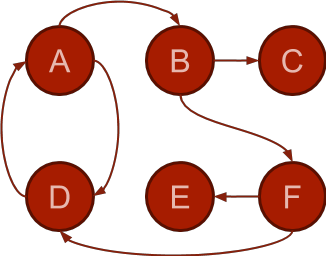
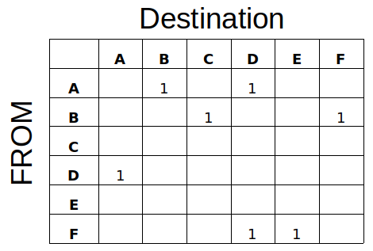
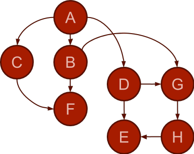

title: Graphs
---
class: center, middle, inverse
# Graphs

---
# Some context...
We've been studying **binary trees**:
 - Each node *may* have up to 2 children.
 - Each node *must* have precisely 1 parent.
There are many other tree-based data structures in Computer Science - we've just scratched the surface.  Many are binary trees, but many other are N-Trees - allowing arbitrary numbers of children.

.callout[
What if each node can have any number of *parents* however?  This is no longer a tree - it is a graph.
]

---
# Graph
.split-left[

]
.split-right[
- Each node is generally called a **vertex**
- The lines between verticies are called **edges** or **links**.
- A **graph** is a set of vertices and edges.
]

---
# Graph
.split-left[

]
.split-right[
- When edges have **arrows** it means traversal over edges is **one-way**.
- Graphs with directed **edges** are called **digraphs**.
- Graphs without directed edges are called *undirected* graphs... or just graphs :)
- Two-way traversal is implied if no arrows are drawn.
]

---
# Graph
.split-left[

]

.split-right[
- **V(G)** is finite, non-empty set of vertices.
- **E(G)** is set of edges, written as pairs of vertices.
]

.clear[

**V** = {A, B, C, D, E, F}

**E** = {(A, B), (B, C), (B, F), (F, E), (F, D), **(A, D), (D, A)**}

]

---
# Adjaceny
.split-left[

]

.split-right[
- Two verticies connected by an edge are **adjacent**.
- C is adjacent **from** B.
- B is ajacent **to** C.
- *not the reverse*.
]

.callout[
A `graph` implementation can have an arbitrary **vertex** class, holding information relative to the application.  Edges are often represented using a matrix, rather than "pointers to vertices" - which might seem more intuitive...
]

---
# Adjaceny Matrix
.split-left[

]

.split-right[

]

.callout[
The adjacency matrix can be represented by a `vector` of `vectors`.  While we *could* use `bool` as the type - we'll use `int`, as it will later allow us to represent edges with **weights**.
]

---
# Graph ADT
```c++
template typename<V> 
class Graph{
    public:
        Graph(); 
        void add_vertex(const V & v);
        void add_edge(const V & start, const V * end);
        queue<V> adjacent(const V & start)
    private:
        vector<vector<int>> adjacency;
};
```

.callout[
The **vertex type `V`** can be anything, but whatever type you use, it must support `==` operator.
]

---
# Path finding
So far graphs aren't very interesting... but now let's start determining if there are paths through the graph from vertext to vertex.  
- It should be pretty obvious what path finding could be useful for!

.split-left[

]

.split-right[
**Find a path from A to H**
- First option - **Depth-first**
  - Pick an edge
  - travel until there are no more edges
  - step back
]

---
# Depth first implementation
- One challenge is that we need to be wary of cycles.
 - Depth first travels along a path until we hit a dead-end...
 - If A connects to B, B connects to C, and C connects to A, our algorithm would never complete.
 - We will need to keep track of which vertex we visit.
- Another challenge is the "go back" part... after we hit a dead end.
 - What type of data structure lets us "go back" to the last thing?

---
# Depth first outline
0. Push `start` vertex onto the stack
1. Set `current` to top of stack, and `pop` stack.
2. If `current` is the destination, then stop.
3. If `current` was already visited, **goto step 1**.
4. Mark `current` as visited.
5. Get all adjacent vertices of `current` and `push` onto stack
6. **goto step 1**.

---
# Keeping track of visited
One easy option would be to have a `visited` flag on the vertex object...
- **However** - the vertex object is a template type - it's anything!

Another option is to hold a list of vertices visited.  Then we'd just need to lookup the vertex to see if it was visited.
- **What data structure supports lookup well?**

---
# Depth-first or Breadth-first
Think of the *adjacent* vertices as the **frontier**.  When searching for a path, the vertices you can see from the `current` vertex are your frontier.  

.split-left[

.callout[
Let's implement breadth-first now - but refactor a bit so we are not repeating all of our code.
]
]

.split-right[
**Depth First**
- We select one frontier vertex and push forward in that direction.
- Once exhausted, we travel back and select another from the frontier - **a stack**.

**Breadth First**
- We explore the entire frontier before pushing forward along.
- We process the **frontier** *in order*.... **queue**
]


---
# Weighted edges
Most graph edges are weighted - which creates more interesting search patterns.

.split-left[

.callout[
Find the **shortest** path from A to F
]
]
.split-right[
Path is governed by the order we process the frontier.
- Depth-first = **stack**
- Breadth-first = **queue**
- Shortest = Best = **priority_queue**
.info[
Instead of vertices, we will store `path`s in the priority queue, with priority being the total weight/cost.
]
]
---
# Conclusion
What is the runtime of our path finding algorithms?
- Look at all the data structures we used!
--

    - map
    - stack
    - queue
    - priority queue