title: Heap Sort
---
class: center, middle, inverse
# Heap Sort
Leveraging data structures for sort

---
# Data Structures for Sort? 
Our last sorting algorithm (radix) employed **queues** to force FIFO access to *buckets*.

*Idea*: Could we use other data structures to actuall help us sort?
- Binary Search Tree:  Adding to a BST enforces order, and we've already seen traversal!
- For N values, add them to a BST, and then traverse (depth-first)!

---
# Problems with using BST
Remember that BST only achieve O(logN) when the tree is balanced.
Additional issues:
- Pointer access is slower than accessing an array.
- Space is a problem - we have to actually build and disassemble the tree.

.callout[
Even with these problems - we still have an N &middot; logN sorting algorithm - **which is better than insertion/selection/bubble sorts!**.
]

---
# Heaps
Recall that a **heap** is a tree, whose *minimum* value (or max) is always accessible at the root.

A heap has several advantages over BST:
- Heaps lend themselves to arrays, not dynamic/pointer access
- We can build a heap within the same (existing) array we are trying to sort!

A **heap** sort builds a heap *in place*, and then removes from the heap in order.
- Insert into heap is O(logN), which is performed N times.
- Removal from heap is O(logN), and is performed N times.
- This gives us N &middot; logN sort.

---
# Building the Heap
Which of the following nodes are already a heap?

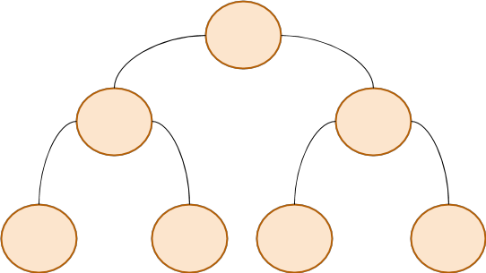

---
# Building the Heap
Which of the following nodes are already a heap?

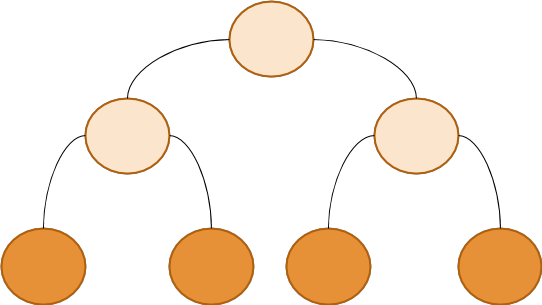

The leaves are already heaps - they have no children to ruin the ordering rules.

---
# Re-Heap
We need to work our way up...
.split-right[
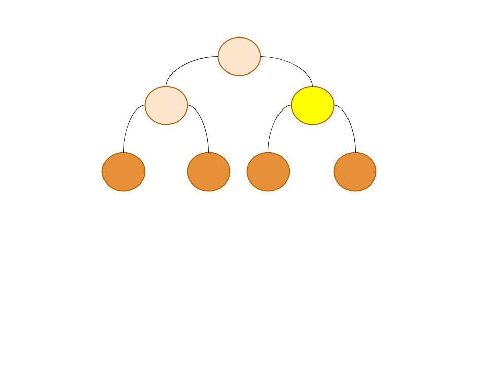
]
.split-left[
Given a "heap" whose root is not in order, 
Swap the root with the largest of it's two children, and **repeat**.
.info[
It's a recursive process - the "root" will be pushed down until it is larger than all of it's children.  
]
]

---
# Array-Based Re-Heap
- Recall that given an element at index (i), we know where it's children are:
 - Right: 2 * i + 1;
 - Left: 2 * i + 2;
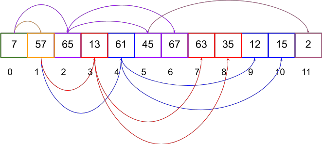

.callout[
We will start at the last element, and call **re-heap** on it.  Once we have a heap at an element, move left (decrement index) and call **re-heap** on it.
]

---
# Reheaping
We can visualize better as a tree, keeping in mind we will do this on an array.

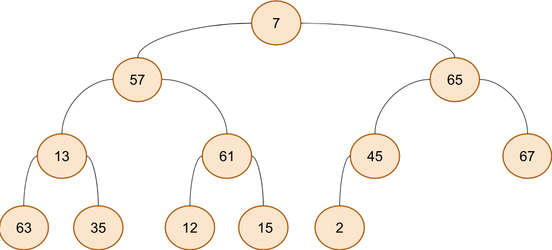

---
# Reheaping
We can visualize better as a tree, keeping in mind we will do this on an array.

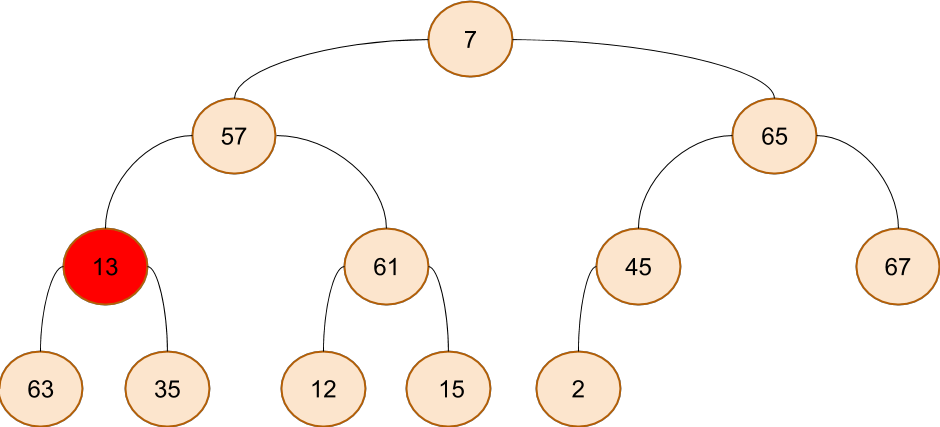

---
# Reheaping
We can visualize better as a tree, keeping in mind we will do this on an array.

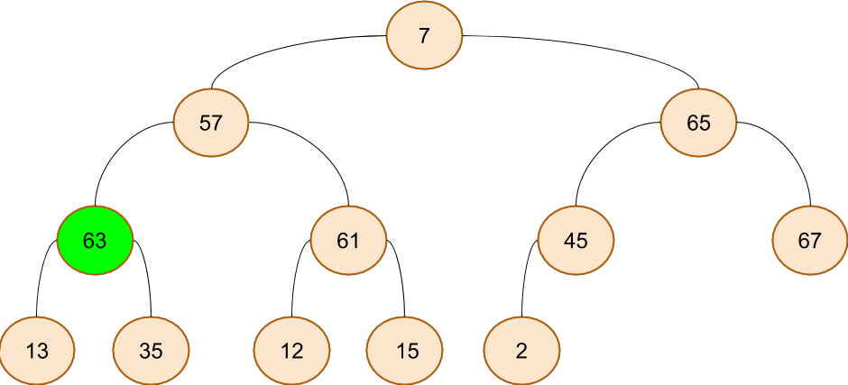

---
# Reheaping
We can visualize better as a tree, keeping in mind we will do this on an array.

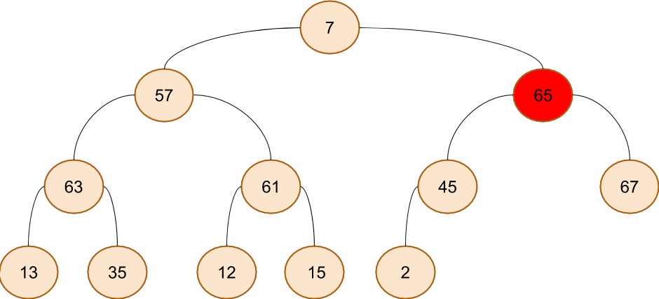

---
# Reheaping
We can visualize better as a tree, keeping in mind we will do this on an array.

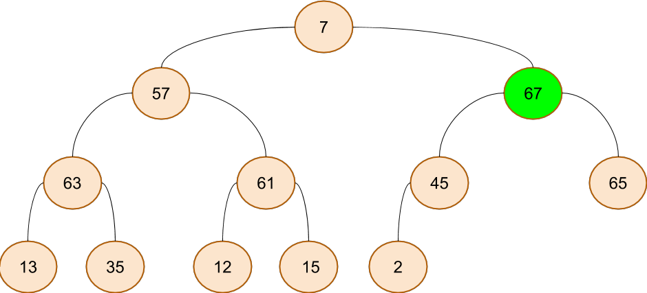

---
# Reheaping
We can visualize better as a tree, keeping in mind we will do this on an array.

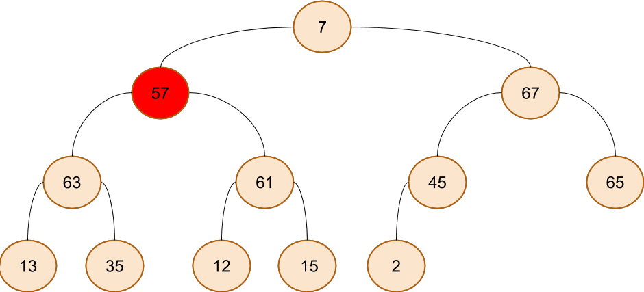

---
# Reheaping
We can visualize better as a tree, keeping in mind we will do this on an array.

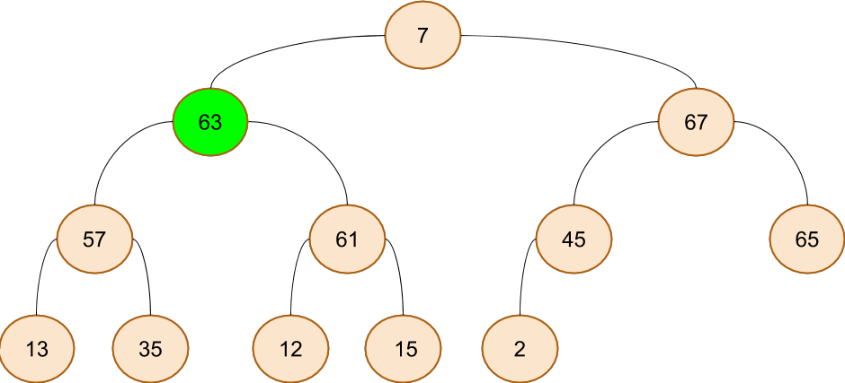

---
# Reheaping
We can visualize better as a tree, keeping in mind we will do this on an array.

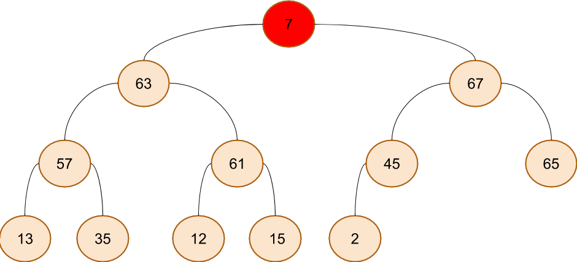

---
# Reheaping
We can visualize better as a tree, keeping in mind we will do this on an array.

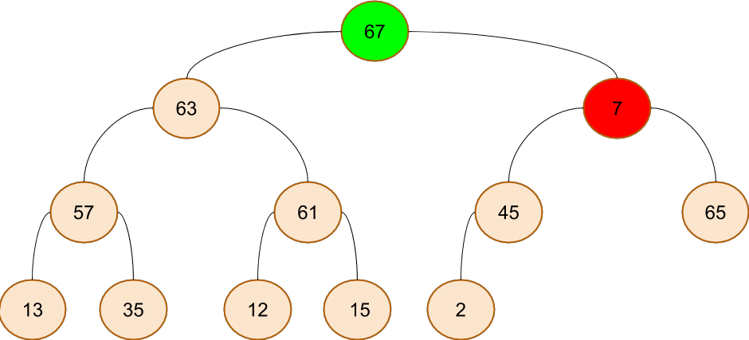

---
# Reheaping
We can visualize better as a tree, keeping in mind we will do this on an array.

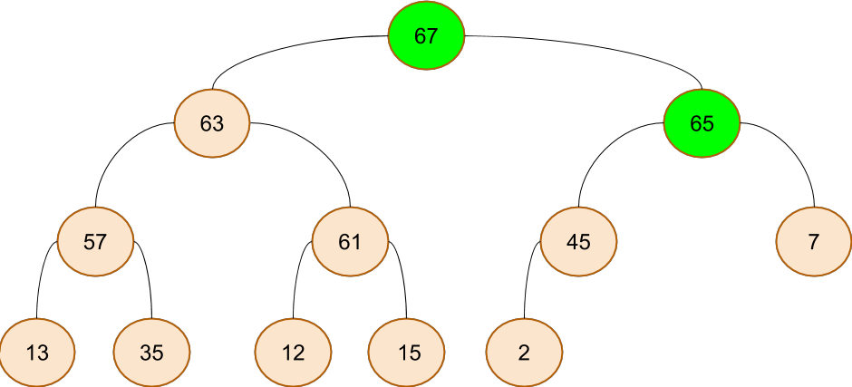

---
# Reheaping
We can visualize better as a tree, keeping in mind we will do this on an array.

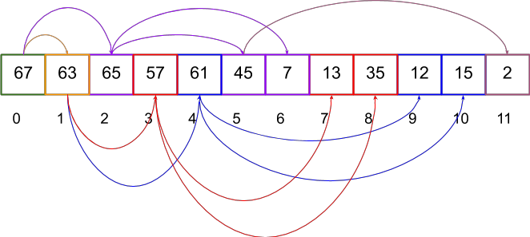

---
# Sorting
Now that we have a heap... we know where the **largest** number is!

Swap this value with the last element.
- This shrinks the heap by 1, grows the "sorted" part by one.
- The root is now out of order - so call **re-heap**.

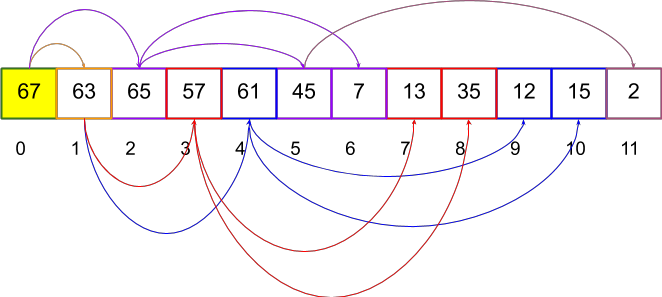

---
# Sorting
We can keep this going, until all elements are removed from the heap...

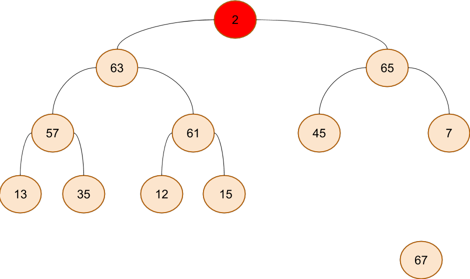

---
# Sorting
We can keep this going, until all elements are removed from the heap...

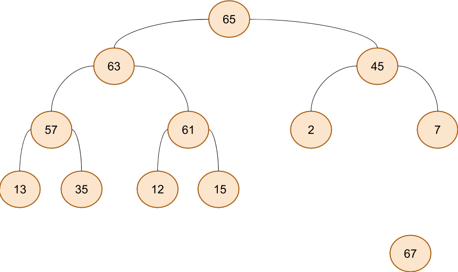

---
# Sorting
We can keep this going, until all elements are removed from the heap...

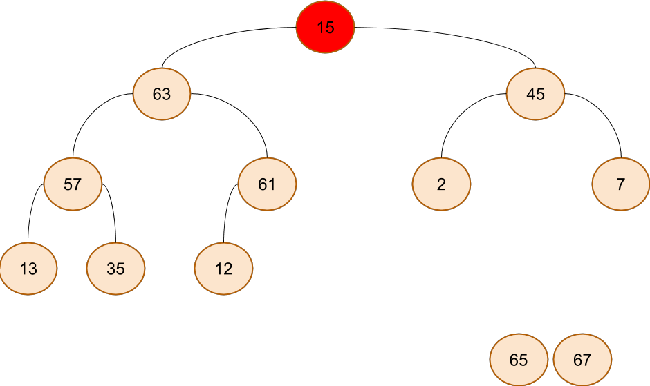

---
# Sorting
We can keep this going, until all elements are removed from the heap...

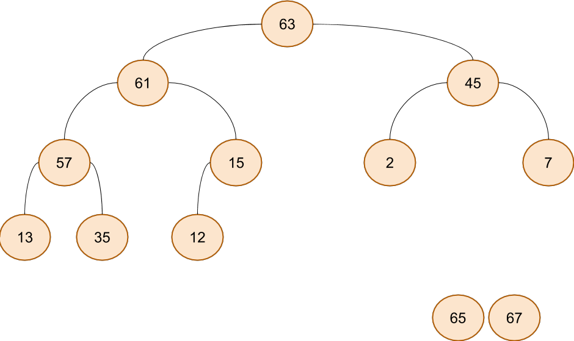

... you get the idea :)  Let's look at the code now.

---
# Conclusion
The heap sort is our best *general purpose* sort yet...
- It has excellent memory efficiency.
- It's sort time is N &middot; logN
 - Each insert/remove from heap is logN
 - We have 2 &middot; N insert/removes, but the constant doesn't matter much here.
 - We can use a raw array, which gives us the best speed possible.