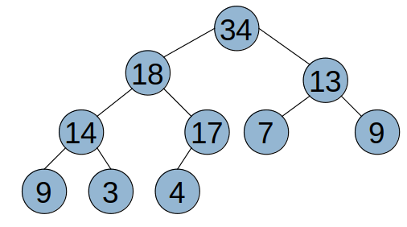
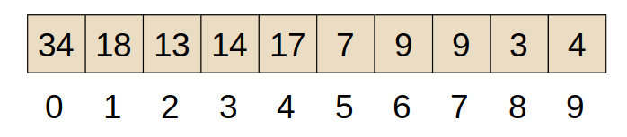
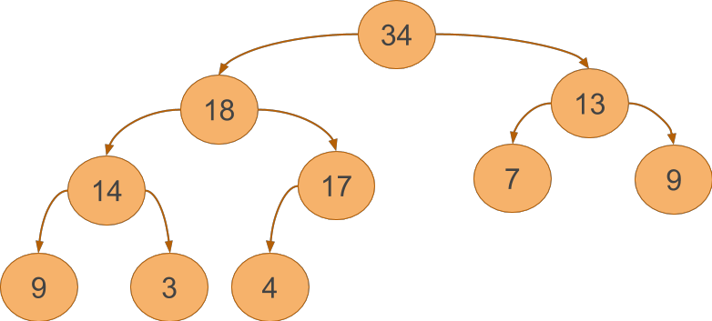

title: Heaps
---
class: center, middle, inverse
# Heaps
Array-based trees, priority queues

---
# Array-based? 
There are *minor* disadvantages of linked node-based implementations:
- Memory overhead (each node has two pointers)
- Pointer access is not "free".
In fact, we *could* represent a binary search tree in an array
 - We can compute the position in the array for a child node
 - **Let's start with a complete tree**.
 - Note that a tree doesn't **need** to be a binary search tree either... it could hold any data.

---
# Array layout

.split-left[

]
.split-right[
- **Given a node at index `i`**
- Left child is at index `2i+1`
- Right child is at index `2i+2`
]


---
# Array-based search tree
- Without an ordering rule, it's easy to ensure the tree is complete.
- For **search** trees, that's a lot harder...
 - Remember, even AVL trees are not complete, some interior nodes will still be leaves.

.callout[
We could initialize all array slots with a **special** value, to indicate "empty".
... although what would the special value be?
]

--
.callout[
While possible, it's not trivial to implement a search tree as an array without making other sacrifices. 
]

---
# So why did we look at it?
A Binary Search Tree is only one type of tree, there are other data structures (aimed at solving other problems) that use tree structures, the **can** be implemented very effectively as arrays.

- One such data structure is a **heap** - which is usually associated with a **priority queue**.

--

A **queue** implements a first-in-first-out method of insert/remove.

A **priority** queue implements a strategy where every value is assigned a **priority** - and we always remove (access) the **highest** priority value.

---
# Heap Layout
In a **heap**, the only ordering rule is that the highest priority values is always found **at the root**.
- This is a recursive definition however - so every *sub-tree* is also a heap.
- There is no ordering rule between children - you do not need values in the left side to be greater or less than values in the right side.
- **A heap is always a complete tree** - making it ideal for arrays.

.callout[
For now, we will keep the design simple.  **Priority** will simply be the integer value being stored.
- Later, we can discuss holding arbitrary objects, with a priority value associated with them.
]

---
# Heap Layout



---
# Heap operations
- `push` - inserts value
- `top` - returns highest priority value
- `pop` - removes highest priority value.

After each operation, we must have a heap - a complete tree whose highest priority value is at the root.

.callout[
Let's look at `insert` - where do we put the new value?
]

---
# Heap insert
We always need a complete tree - so the first step we take is to add the new value at the end of the array.
- We now know that we still have a complete tree - it is being filled left-to-right, one level at a time.
- **However**, there is no assurance that the new value is in the right place...

The next step is to *bubble up* the value:
- If the current node is larger than it's parent, swap the value of the parent and current node (index)
- Repeat!

.callout[
This works no matter which direction (left/right) we are bubbling up, because we know the tree was a heap **before** insert.
]

---
# Heap remove
We can only remove the highest priority node - which is at the root.
- Index 0 always holds the root - so this is easy.
- However, we need to select the right node to bubble up to take it's place.

.callout[
We take an unintuitive first step... pull the **last leaf node** from the end of the array, and put it at the root.
This ensure we still have a complete tree.
]

---
# Heap remove - step 2
Step two is to **push the node down** to satisfy the ordering rule.
- If current node is smaller than either child, **swap with largest child**.
- Repeat!

---
# Performance
We've created a priority queue that always allows us to access the highest number in O(1) time!
- Removal is based on the number of bubble down operations.
- Insert is based on the number of bubble up operations.

--

.callout[
Since we have a complete tree, the number of levels is always log<sub>n</sub>.  This means 
insert and remove are log<sub>n</sub> operations.
]

---
# STL
Recall, when we first looked at the STL, `priority_queue` was one of the containers supported.

```c++
#include <queue>

int main() {
    priority_queue<int> pq;
    pq.push(30);
    pq.push(40);
    pq.push(90);
    pq.push(60);

    pq.pop(); // removes 90.
    cout << pq.top() << endl; // prints 60
}
```
We can use arbitrary objects, not just `int`.  Our objects would need to overload the **comparison** operators, so the priority queue could compare the objects by priority.

