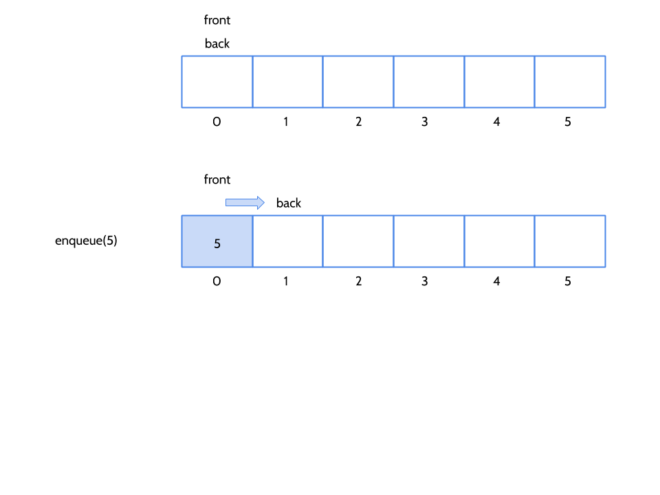
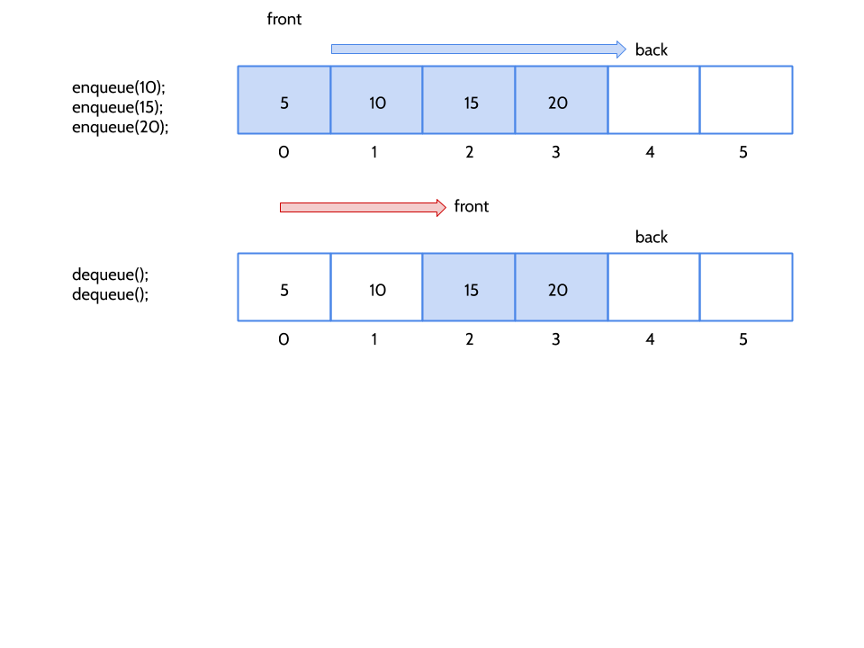
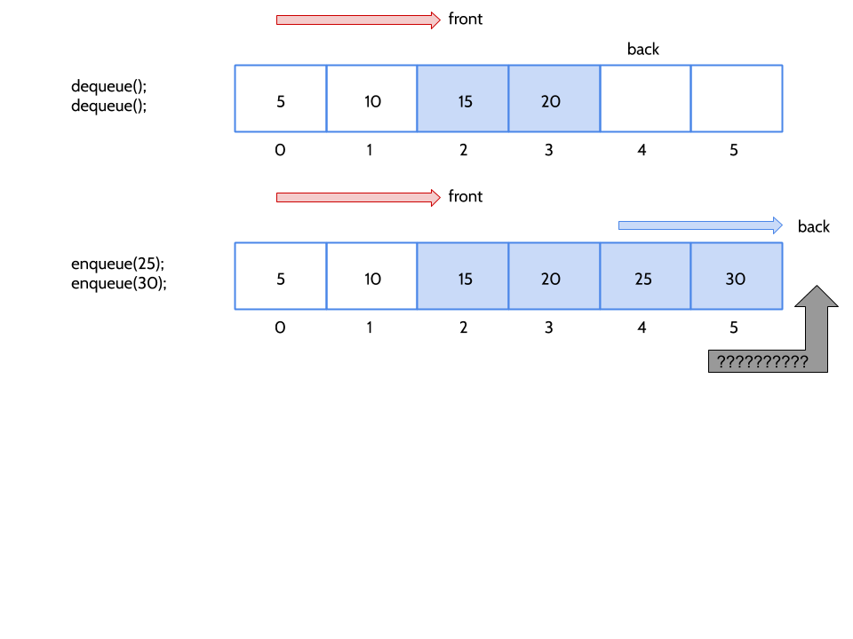
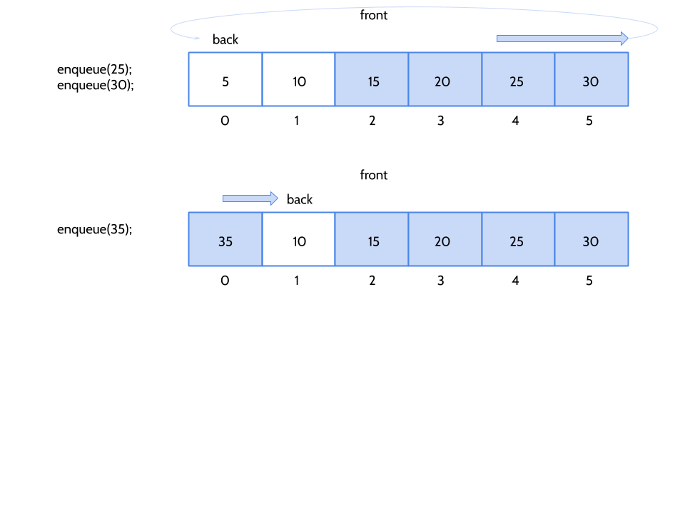

title: Lists, Queues, and Stacks
---
class: center, middle, inverse
# Lists, Queues, and Stacks

---
# Lists... continued
We looked at `append` and `prepend` in Lab 2.

Now let's take a look at some more difficult behaviors:
- `insertAt(int index, int value)`;
- `remove(int index)`;

.callout[
- First let's create a project directory, and test cases - using the Lab 2 template
- We'll review the solution to the Lab 02 along the way
]

---
# Sorted lists
Sometime we use data structures to enforce / implement algorithms.

Let's create a modified class to support insertion / deletion on a **sorted** list.

We won't give the caller the ability to specify and index to insert to - the location where the new values are inserted are determined by the data structure itself.

.callout[Notice how C++ `private` can limit functionality, creating a simplified interface.  Abstraction at it's finest!]

---
# Performance
We are going to talk a lot about performance in this class.
- Computational Complexity
- Memory Complexity

.callout[
    Which operations on our list are the most time consuming?
]

---
# What if we limit behavior?
Perhaps we could design a collection class that offered *some* of the features of our list, but with better performance...

.callout[
It is very common to be able to make a **subset** of operations faster, if we **drop** the others.  This is called a **tradeoff**, and it is why we have **many** different types of collections in computer science!

As you will see, we often design data structures *around* algorithms, and algorithms *around* data structures - **they work together**.
]

--
- Support insert/remove only from the front and back of the list
  - A **queue** supports removal from front, and insert to back (or vice-versa)
  - A **stack** supports removal and insert to the same end (front, or back, but not both)

---
# Queue
Why would a queue be helpful to anyone?

--

We usually call insert/remove as follows:
- `enqueue()` - add to end
- `dequeue()` - remove from front
---
# Queue Implementation
- **The naive approach**:  Implement this with our `ArrayList`.  Why might this be sub-optimal?
--

.callout[A better approach is to keep track of the front and back of the list (indices) separately - rather than always assuming the front of the list is at index 0.]

---
# Queue Implementation

---
# Queue Implementation

---
# Queue Implementation

---
# Queue Implementation

---
# Queue Implementation

---
# Queue Details
There are some additional concerns...
- How do we know if the queue is full?
- What if we `dequeue` lots of times too - doesn't that need to also wrap around?
- How do we know if the queue is empty?

---
# Queue Specification
- enqueue - throws length_error if no more room.
- dequeue - throws length_error if empty.
- is_full - return true if full
- is_empty - return true if empty

---
# Stack
Why would a stack be helpful to anyone?

---
# Stack Implementation
The implementation of a stack is **much** easier, because only one end of the array changes.
- `push` - add to top of stack
- `pop` - remove from top of stack

The end of the array that gets added too / removed from is an *implementation* detail.  

**Which end do you think we should use?**

---
# Time Complexity
We built an `ArrayList` which is a swiss-army knife of a data structure.
- Time to insert tends to grow **linearly**.
- Time to remove tends to grow **linearly**.

Our queue supports a very specific use-case, **first in, first out**.
- It's limited scope allows for optimization - `enqueue` and `dequeue` are **CONSTANT** time.

Stack have the same benefit - they are **last in, first out**, and have **constant** time complexity.

---
# Lab 3
Construct a **deque** - a data structure that merges `queue` and `stack`.
- `push_front` - insert at front
- `push_back` - insert at front
- `pop_front` - remove from front
- `pop_back` - remove from back
- `is_empty` - return true if empty
- `is_full` - return true if full

.callout[Can you do this such that all operations are **constant** time?]