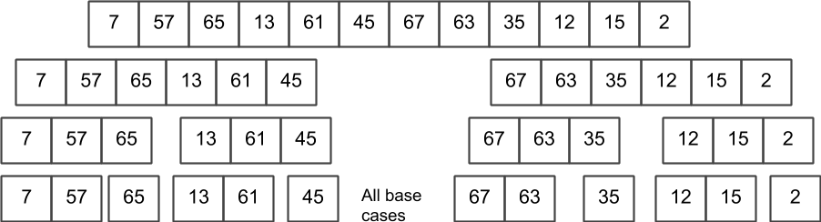
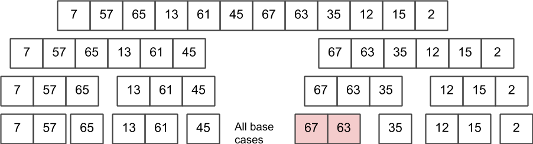
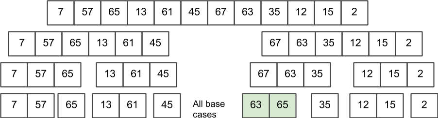
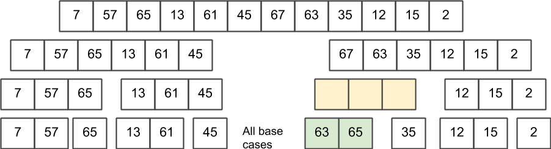
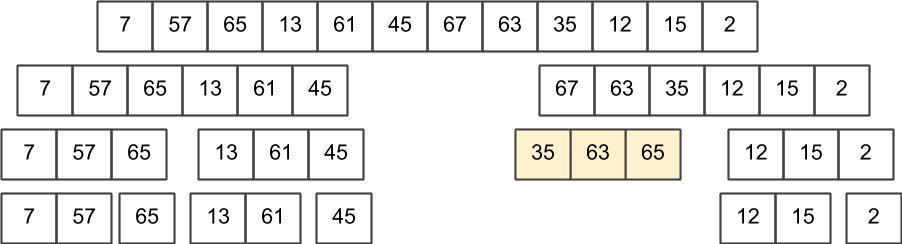
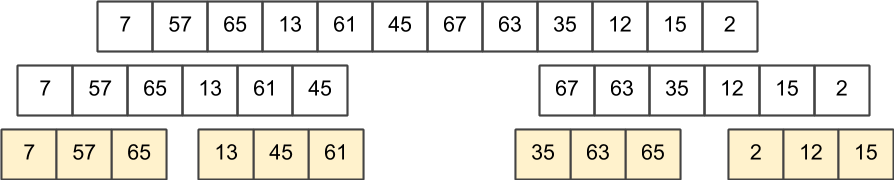
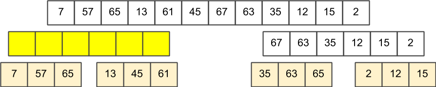
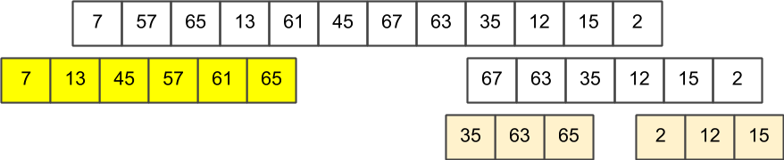
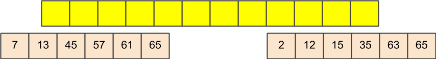

title: Merge Sort
---
class: center, middle, inverse
# Merge Sort
Leveraging recursion for sort

---
# Splitting a list...
What is easier?
- Sorting one large list?
- Sorting 2 smaller lists?

.callout[
Since our sorting algorithms grow faster than N, we can say 2 smaller lists are better to sort, as opposed to one...
]

---
# Merging lists
Given 2 sorted lists, could we merge them to form a larger sorted list?
- Until lists A and B are empty:
 - Take the smallest number between the first value in A and B, and add to list.

.callout[
- This is an O(N) operation - we just tear through the lists.
- So... given two sorted lists, we can merge easily!
]

---
# Merge Sort
**Concept**:
- If list size <= 2:  sort the two numbers (or leave alone).
- Otherwise, split list in half, and **sort** both sides, and **merge**.

.callout[
How do we "sort both sides"....?
]
--
.callout[
By splitting the list and merging... of course :)
]

---
# Merge Sort

---
# Merge Sort

---
# Merge Sort

---
# Merge Sort

---
# Merge Sort

---
# Merge Sort

---
# Merge Sort

---
# Merge Sort

---
# Merge Sort

---
# Merge Sort

---
# Merge Sort

---
# Merge Sort

---
# Merge Sort

---
# Merge Sort

--

.callout[
Let's look at the implementation
]

---
# Not quite...

Our implementation is deliberately simplistic - to make it easier to understand.
- In reality, we are making **very** poor use of memory
- It would be more effective to do this in place, **which is possible!**

---
# Conclusion
Merge sort *can* be memory efficient, and is similar in time complexity to heap sort:
- The list must be split into consituent lists - O(logN) lists.  
- The consituent lists are all merged - which is an O(N) operation.
- The resulting algorithm is O(N &middot; logN)