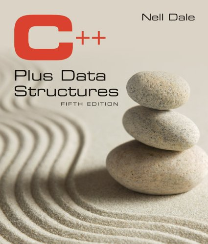
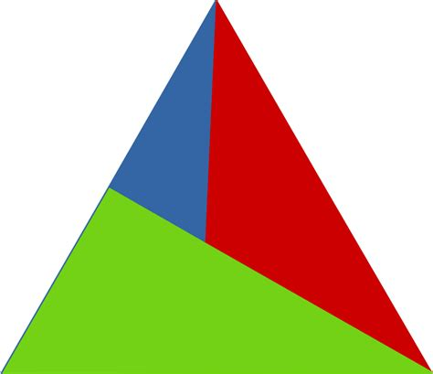

title: Course Outline
---
class: center, middle, inverse
# Course Outline
## CMPS 231 - Data Structures and Algorithms

---

## Objectives
*A study of the basic data structures and related algorithms used in software development. Lists, stacks, queues, arrays, trees, graphs, strings, sorting, searching, and file structures are among the topics presented in this course.*

1. A reinforced understanding of C++ classes and object oriented programming.
1. A fundamental knowledge of abstract data types, their implementation and algorithms that manipulate them.
1. An understanding of the analysis of algorithms.
1. The ability to select the proper data structure and related algorithm for a given application.
1. A better understanding of the aspects of the C/C++ language and improved programming skills.

---
# Additional Objective
- Learn how to program in a professional way
 - Using several platforms
 - Writing clear, maintainable code
 - Leveraging automated testing to ensure program correctness

---
# Pre-Requisites
You are required to have completed CMPS 147 and CMPS 148, with a minimum grade of C.

You are expected to already know C++:
- Variables, Selection (if/else), Loops
- Functions
- Arrays
- Classes and Objects
- **Templates**

*We will review these topics, briefly*.

---
# Topics
- Getting started
 - Development Environment and CMAKE
 - Review of Selection, Loops, Arrays
 - Unit testing
 - Review of Classes and Objects
- Array-Based Data Structures
 - Stacks, Queues
 - STL, C++ Vectors
- Pointer-Based Data Structures
 - Pointer Review
 - Linked LIsts
- **Exam 1 - October 10th**

---
# Topics
- Improved Memory Management
 - C++ `auto`s and smart pointers
 - Sorted linked lists
- Data Structures for Search
 - Review of Recursion
 - Binary Search Trees
- Priority Queus
- Graphs and Search
- Hash Tables and Maps
- **Exam 2 - November 21st**

---
# Topics
- Sorting
 - Bubble Sort
 - Selection Sort
 - Radix Sort
 - Merge Sort
 - Quick Sort
 - **Final Exam - TBD**

---
# Course Materials
The entire syllabus, all the assignments, and our schedule is available at:

[https://pages.ramapo.edu/~sfrees/courses/cmps231/](https://pages.ramapo.edu/~sfrees/courses/cmps231/)

We will use Moodle to submit assignments, and I will provide grades / feedback through Moodle - *but otherwise, all course material will be on the course web page*.
---
# Textbook

## C++ Plus Data Structures
5th Edition

Nell Dale

ISBN-13: 978-1449646752

ISBN-10: 1449646751 

.callout[The textbook is required.  We will cover many topics NOT covered by the text book, but the topics that the text book does cover at the core of the course's objectives.]

---
# Coding Environment
We will be using a C++ programming environment **that you might not be used to**.  It will center on POSIX-compliant `g++` or `clang` compilers, `CMake` build tooling.  

*We will not use Visual Studio, or Xcode*.

There are two reasons for this:
1. These tools are used heavily in industry, **you need to be comfortable with them** (and break out of your own comfort zone).
2. They will work identically on all operating systems.

.callout[We will go over the programming environment in great detail shortly]

---
# Lecture time & Attendance
A three hours (plus) lecture is far too long for me to keep your attention... so I won't try to most weeks.
- Most weeks:
 - We will have lecture for roughly 2 hours
 - We will complete an in-class lab assignment during the remaining time.

Your **Attendance** grade **is your lab grade**.  Labs will be required to be completed **in class**, but the end of the lecture period.  

You must be physically present to receive credit.

---
# Labs and Homework
**Labs** - can be worked on in teams of 2-3 students.  
**Homework** - must be worked on independently

Labs will be graded *on the spot*, before you leave.  No late assignment accepted.

Homeworks will take longer to grade - and you will receive a 10 point late penalty **per day**.

.callout[Labs and Homeworks will always be distributed to you **with testing code**.  This testing code will allow you to clearly know what grade you will receive (although code formatting and style will also play a role).]

---
# Exams
Exams will be **open book, open notes, open internet**.

Exams will be a mix of code and concepts.

You will always have the full lecture period to complete the exams.

---
# Grading Weights

<table>
    <thead>
        <tr>
            <th> % </th>
            <th> Activity </th>
        </tr>
    </thead>
    <tbody>
        <tr>
            <td> 10% </td>
            <td> Labs </td>
        </tr>
        <tr>
            <td> 20% </td>
            <td> Homework </td>
        </tr>
        <tr>
            <td> 40% </td>
            <td> Exams (&times; 2) </td>
        </tr>
        <tr>
            <td> 30% </td>
            <td> Final Exam </td>
        </tr>
    </tbody>
</table>
        
---
# Academic Integrity
I have written extensively about academic integrity on the course syllabus:
[https://pages.ramapo.edu/~sfrees/courses/cmps231/](https://pages.ramapo.edu/~sfrees/courses/cmps231/)

The syllabus links to another document, elaborating on what is expected of you:
[https://pages.ramapo.edu/~sfrees/integrity.html](https://pages.ramapo.edu/~sfrees/integrity.html)

.callout[It is your responsibility to read these policies, if you do not understand them - **see me**.]

---
# That's about it...
Let's move on to learning about our development environment...

