title: Quick Sort
---
class: center, middle, inverse
# Quick Sort

---
# Sorting two smaller lists
When we looked at merge sort, we asserted that sorting two small lists is faster than sorting one larger one.
- We created two lists by **dividing the list in half**.
- Quick sort employs a different strategy, which *often* outperforms merge sort.

**Idea**:  Select a *pivot* value (not index).
- Divide list in two (possibly unequal) lists:
 - One with elements *less than or equal* to pivot value,
 - One with elements *greater than* pivot value
- Employ the same recursive approach, until each list is *small enough*.
 - The **regroup**.

---
# Questions
- How do we choose a pivot value?
- How do we split the list?
- How do we regroup?

---
# Pivot
It turns out, the pivot value isn't actually all that important - as long as you are consistent about it.
- Let's make the pivot value whatever is in the first element.

---
# Splitting
The splitting method is where most of the magic is going to happen...
- We keep track of two points - left and right 
 - They start at the first element (left) and last (right)
- Slide the left towards the end of the list until we find a value **greater** than pivot
- Next. slide the right towards the front until we find a value **less than or equal** to the pivot.
- Now swap the values at the left/right indices.
- When left/right meet - we've found the **split point**.

---
# Splitting
The splitting method is where most of the magic is going to happen...
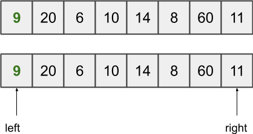

---
# Splitting
The splitting method is where most of the magic is going to happen...
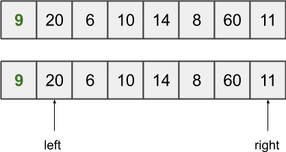

---
# Splitting
The splitting method is where most of the magic is going to happen...
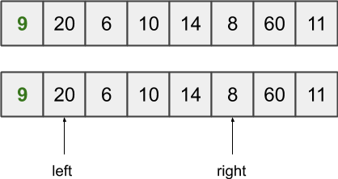

---
# Splitting
The splitting method is where most of the magic is going to happen...
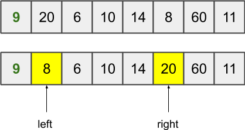

---
# Splitting
The splitting method is where most of the magic is going to happen...
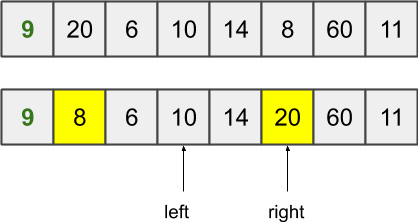

---
# Splitting
The splitting method is where most of the magic is going to happen...
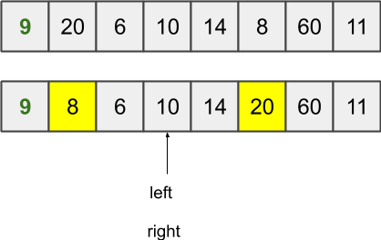

---
# Splitting
The splitting method is where most of the magic is going to happen...

We now repeat this for both of the lists - **however**:
 - We will get poor performance if we re-use the exact same pivot value (9).
 - We swap the values in the left side list - switching the first and last elements.

---
# Recursive Splitting
We continue to split until all parts are at the base case - 2 or less elements - which can be trivially sorted.

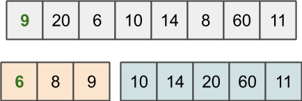

---
# Recursive Splitting
We continue to split until all parts are at the base case - 2 or less elements - which can be trivially sorted.

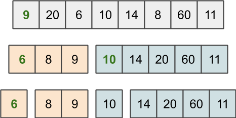

---
# Recursive Splitting
We continue to split until all parts are at the base case - 2 or less elements - which can be trivially sorted.

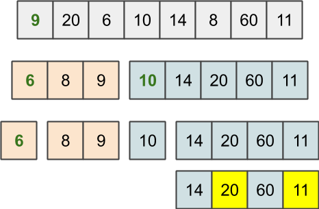

---
# Recursive Splitting
We continue to split until all parts are at the base case - 2 or less elements - which can be trivially sorted.

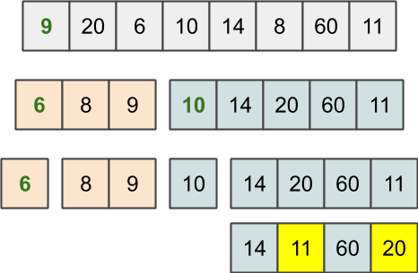

---
# Recursive Splitting
We continue to split until all parts are at the base case - 2 or less elements - which can be trivially sorted.

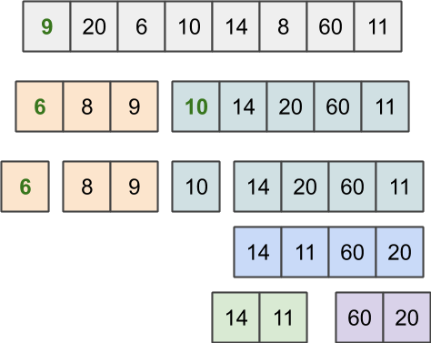

---
# Regrouping
The real power of Quick Sort is that regrouping.... doesn't really exist!

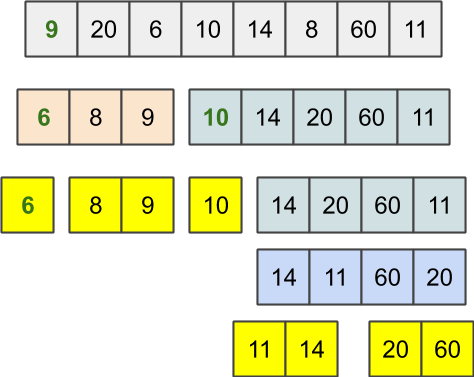

---
# Regrouping
The real power of Quick Sort is that regrouping.... doesn't really exist!

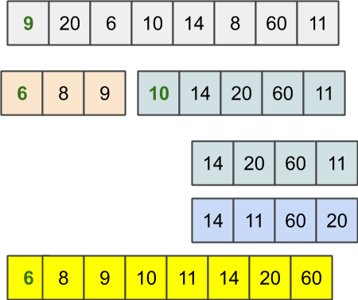

---
# Implementation
.callout[
Let's spend some time on this!
]

---
# Analysis
- Unlike merge sort, we can't **deduce** that there will always be logN lists after recursive splitting - because **we don't split the lists in half**.
- Quick sort, given random data, **does** behave as an O(N &middot; logN) algorithm.
- **However**, given pre-sorted (or nearly pre-sorted) data, our use of *pivot* as the first element actually hurts us - and it degrades to **quadratic**!

.callout[
Commonly, sorting algorithms built into languages/libraries do a quick scan to see if the list is relatively sorted.  If so, *bubble sort* is employed - otherwise *quick sort*.
]

---
# Wrap up
Does this all really matter?
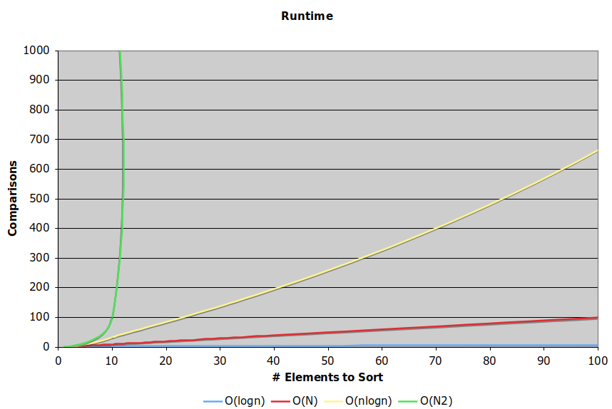

---
# ... Yes!
The difference is huge!

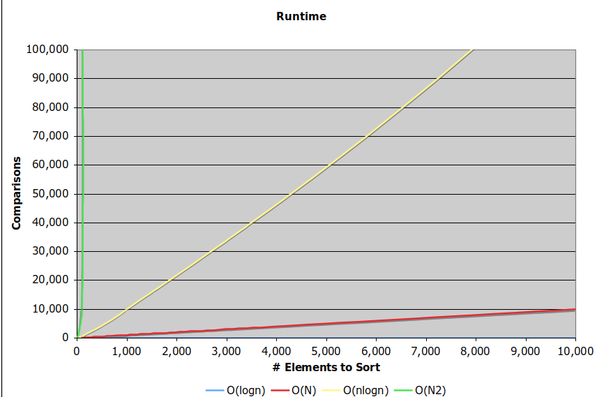