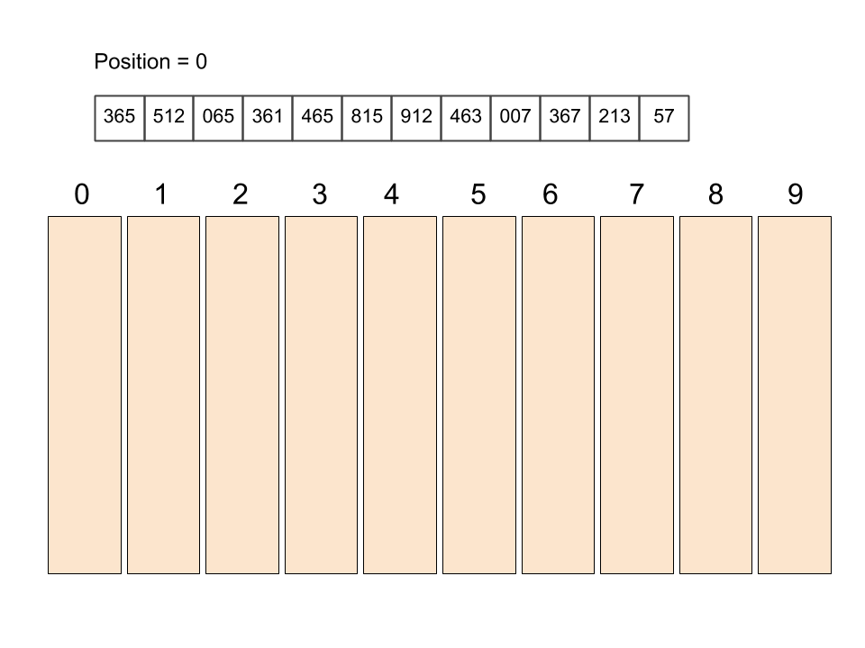
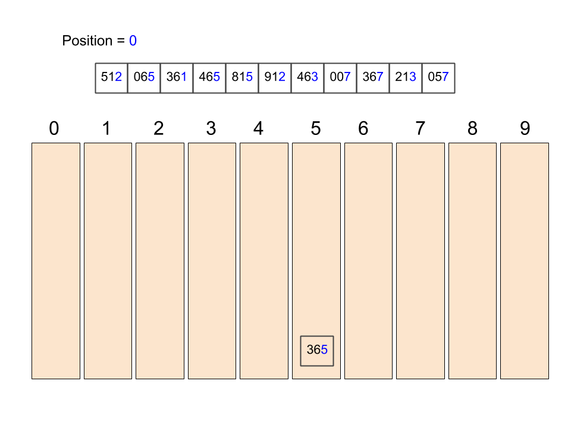
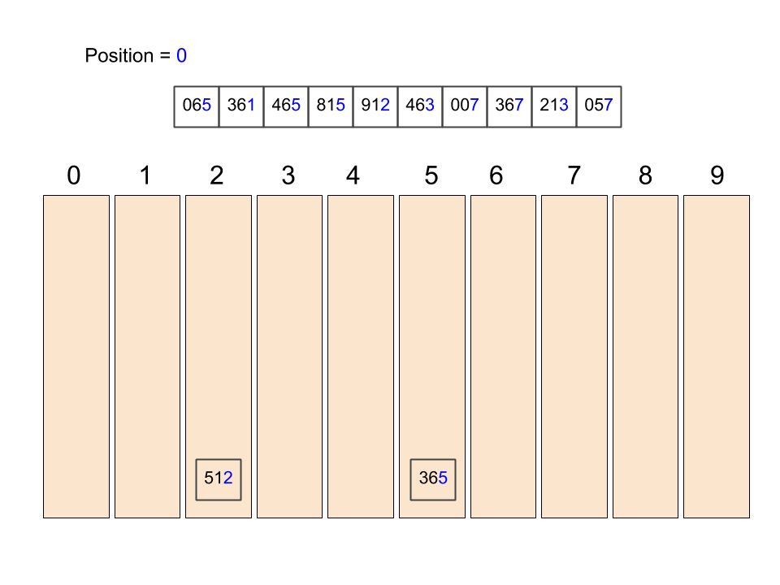
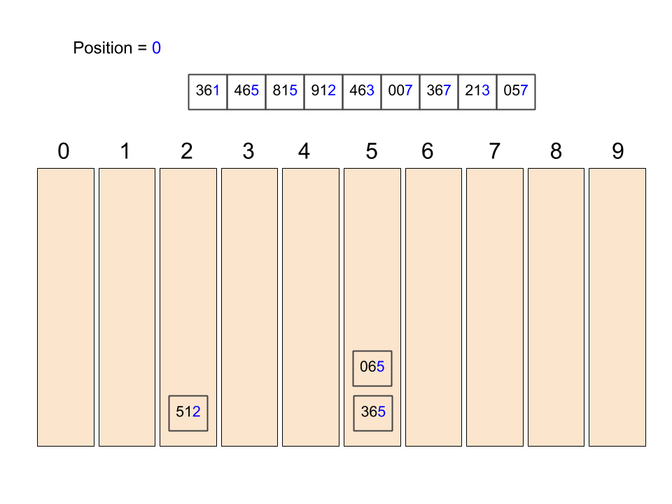
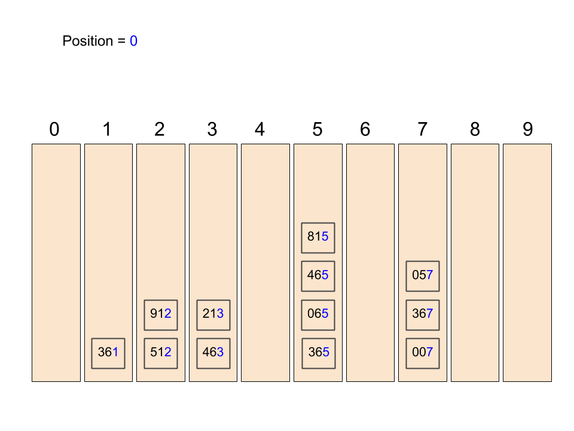
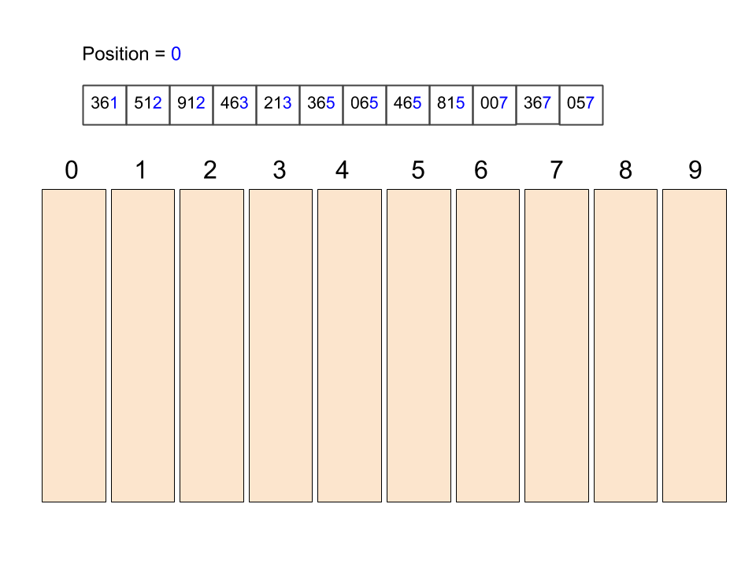
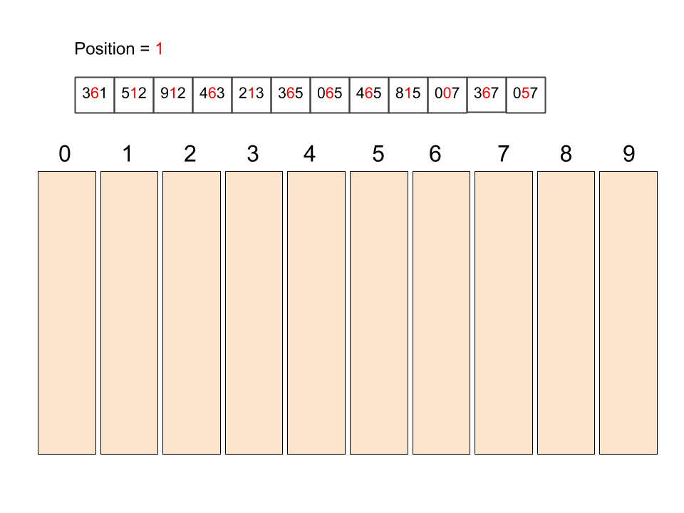
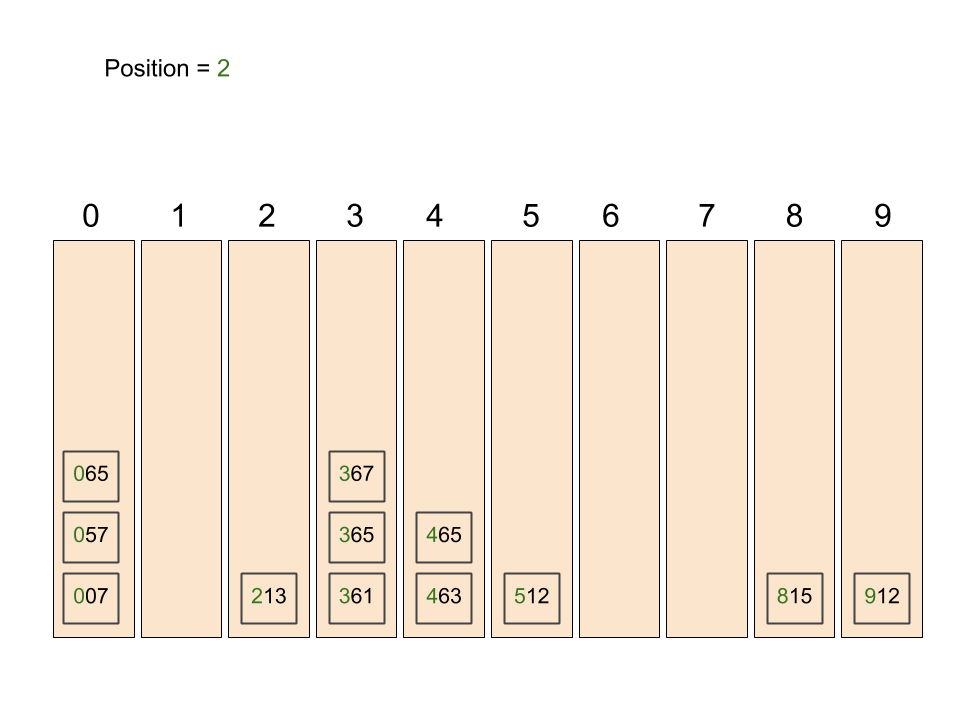
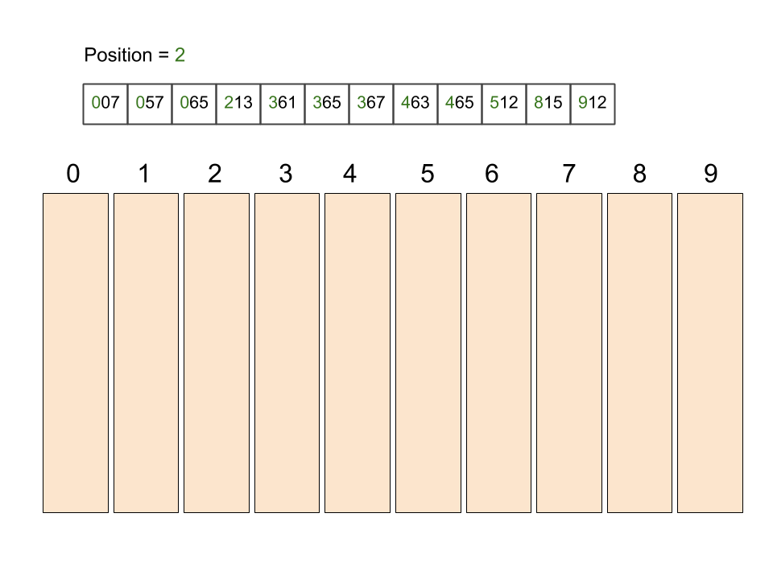

title: Sorting (2)
---
class: center, middle, inverse
# Radix (Bucket) Sort
Leveraging domain knowledge

---
# Review:  Sorting goals
- Speed (time complexity)
- Memory usage (space complexity)

.callout[
- We've seen three algorithms that have O(N2) time complexity.  
- They made no assumptions about the values being sorted.
- They were quite memory efficient.
]

What if we are willing to sacrifice some space, and had a restricted set of values to sort?

---
# Radix Sort
*Problem*: You have a list of unsorted numbers, between 0 and 999.

- Notice that each number in the list has 3 digits, the hundreds place, tens place, and ones place.  We'll call these the **position**.
- The possible values at each position is the **radix** - which in this case is 0-9.

**Idea**:  Construct one **bucket** for each radix.
- For each **position**:
 - Place each number in the designated *bucket* based on the value at the position.
 - Reconstruct the list by appending all the buckets.
After processing each position, the assembled list will be in order - without ever comparing any number against another!

---
# Radix Sort

---
# Radix Sort

---
# Radix Sort

---
# Radix Sort

---
# Radix Sort

---
# Radix Sort

---
# Radix Sort

---
# Radix Sort

---
# Radix Sort

---
# Radix Sort

---
# Radix Sort

---
# Radix Sort

---
# Radix Sort - Analysis
- Buckets implemented as **queues** - FIFO, O(1) insert and remove.
- For each **position**, there are **N** insertions into buckets.
- Thus, the algorithm is O(position x N).
 - As long as position is << N, then we can reason the algorithm is a lot better than quadratic!

Likely hardest part is determining which bucket a number goes in:

- Bucket = value / (10position) % 10
