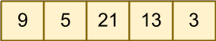
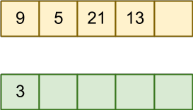
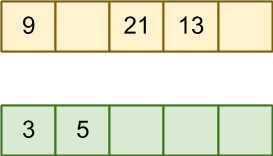
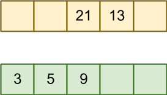
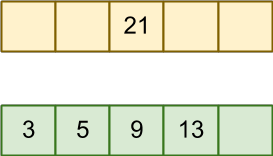
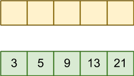
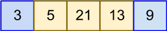
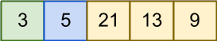
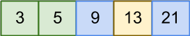
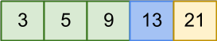

title: Sorting (1)
---
class: center, middle, inverse
# Simple Sorting
Selection, Bubble, and Insertion Sort

---
# Sorting goals
- Speed (time complexity)
- Memory usage (space complexity)

.callout[
In this module, we will examine some simple sorting algoritms.  They are space efficient, however not terribly fast...
]

We will assume we have *unsorted integers* in a **array-like (random access) container**.  

---
# Selection Sort
*Simple idea*: Build a **new** list by selecting, one at a time, the smallest item in the target list, and moving it to the new list.



---
# Selection Sort
*Simple idea*: Build a **new** list by selecting, one at a time, the smallest item in the target list, and moving it to the new list.



---
# Selection Sort
*Simple idea*: Build a **new** list by selecting, one at a time, the smallest item in the target list, and moving it to the new list.



---
# Selection Sort
*Simple idea*: Build a **new** list by selecting, one at a time, the smallest item in the target list, and moving it to the new list.



---
# Selection Sort
*Simple idea*: Build a **new** list by selecting, one at a time, the smallest item in the target list, and moving it to the new list.



---
# Selection Sort
*Simple idea*: Build a **new** list by selecting, one at a time, the smallest item in the target list, and moving it to the new list.



---
# Selection Sort
*Simple idea*: Build a **new** list by selecting, one at a time, the smallest item in the target list, and moving it to the new list.

.split-left[

]
.split-right[
**We don't actually need two arrays though... if we use swap**.
]

---
# Selection Sort
*Simple idea*: Build a **new** list by selecting, one at a time, the smallest item in the target list, and moving it to the new list.

.split-left[

]
.split-right[
**We don't actually need two arrays though... if we use swap**.
]

---
# Selection Sort
*Simple idea*: Build a **new** list by selecting, one at a time, the smallest item in the target list, and moving it to the new list.

.split-left[

]
.split-right[
**We don't actually need two arrays though... if we use swap**.
]


---
# Selection Sort
*Simple idea*: Build a **new** list by selecting, one at a time, the smallest item in the target list, and moving it to the new list.

.split-left[

]
.split-right[
**We don't actually need two arrays though... if we use swap**.
]

---
# Selection Sort
*Simple idea*: Build a **new** list by selecting, one at a time, the smallest item in the target list, and moving it to the new list.

.split-left[

]
.split-right[
**We don't actually need two arrays though... if we use swap**.
]

---
# Selection Sort
*Simple idea*: Build a **new** list by selecting, one at a time, the smallest item in the target list, and moving it to the new list.

.split-left[

]
.split-right[
**We don't actually need two arrays though... if we use swap**.
]

---
# Selection Sort
*Simple idea*: Build a **new** list by selecting, one at a time, the smallest item in the target list, and moving it to the new list.


**Algorithm**:
1. Start at (sorted) = 0
1. Find **index** of minimum from (sorted) to end of list)
1. Swap value of (sorted) and index of minimum.
1. `sorted++`
1. Repeat until sorted == last element

--

.callout[
This is an O(N<sup>2</sup>) algorithm... why?
]

--
**Let's implement it now**.

---
# Pitfall of Selection Sort
There are few issues with selection sort, but worst is that it's average case is the same as the **best case**!

.callout[
What *should* be the best case?
]

--
A selection sort is **quadratic** even if the list is already sorted!

---
# Bubble sort
.split-left[
- Bubble sort scans across the unsorted region, swapping any two adjacent elements which are out of order. 
- The sorted portion always grows by 1 element each time through...
- ... but the added benefit is that the unsorted portion is becoming **more ordered** on each scan.
- We can stop early as well - by simply keeping track of whether or not we had to swap anything!.

]
.split-right[

]

---
# Bubble sort
.split-left[
```c++

swapped = true; // early stop flag

// Start at position 1, look back 1
// to potentially swap

for (int i = 1; i < n ; i++ ) {
    swapped = false;
    // As i increases, the sorted 
    // portion expands left.
	for(int j=0; j < (n-i); j++) {
		if( a[j] > a[j+1] ) {
            swap(a, j, j+1);
            swapped = true;
		}
    }
    // If we run through the 
    // unsorted list without
    // swapping - we are done.
    if (!swapped ) break;
}
```
]
.split-right[

]

---
# Bubble sort - comparison
In the average case, it's still a **quadratic** algorithm:
- For each element:
 - Scan each across each element, swapping as needed.

**However**, when given a pre-sorted (or nearly pre-sorted) list, 
the algorithm behaves closer to **linear** - due to the early stop!

.callout[
While slightly more complex that selection, and similar for typical cases, bubble sort is clearly 
a better algorithm.
]

---
# Insertion sort
Conceptually simple, insertion sort also benefits from early exit conditions:
- Similar to selection, we can conceptualize with two lists.
- For each element in `a`, insert in order into the temporary array.

.callout[
- We already know how to *insert in order* - right?  It's a linear operation.
- We do this for each element - so it's clearly O(N<sup>2</sup>)
]

**We can do this in place**, by growing the sorted portion of the list in each iteration.

--

Let's implement, and see how best-case (pre-sorted) behaves...

---
# Simple sorts
The three algorithms presented work on arbitrary numeric data, and **they are relatively simple**.

- In practice, bubble sort is the most common among them.
- If we are willing to place restrictions on the type of data we are sorting, we can do better.
- If we are willing to get a lot more complex, we can also do better!

**Next up** - sorting numbers confined to a range of values.