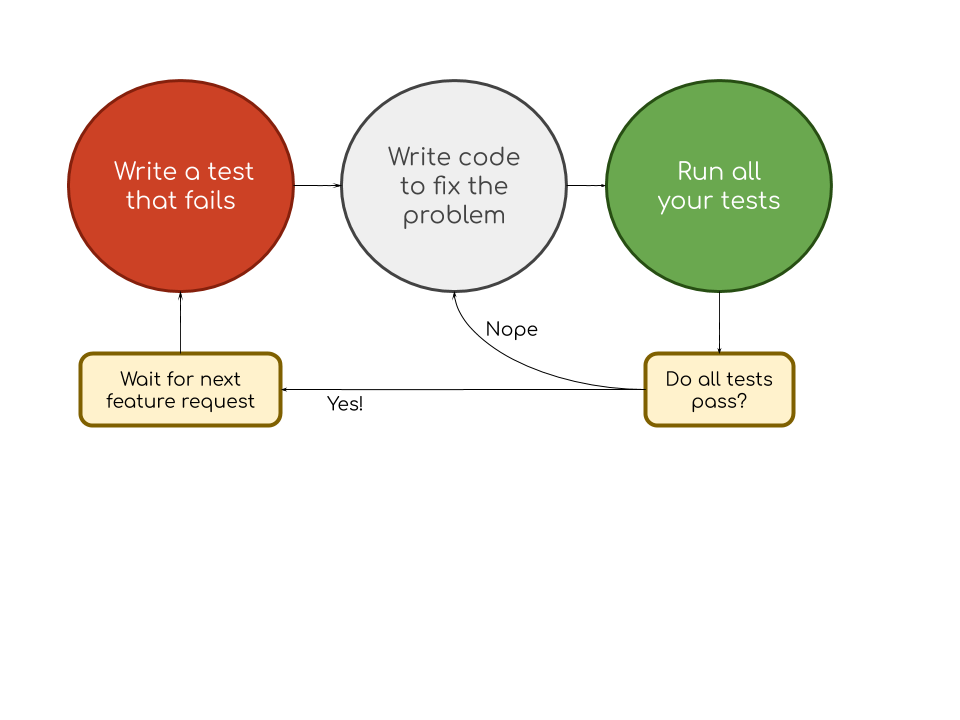
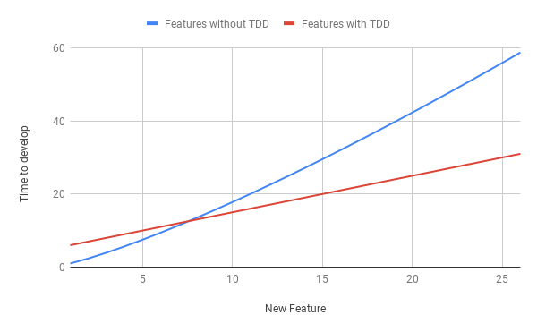

title: Unit Testing
---
class: middle, center, inverse
# Unit Testing

---
# Does it work?
There is a pretty glaring problem with this code...
```c++
if ( a < b && b < c ) {
  cout << "Ascending" << endl;
} else if ( a > b && b > c ) {
  cout << "Descending" << endl;
} else { // Does this really mean the numbers must be equal?
  cout << "Equal" << endl;
}
```

As long as you tested this code *at all*, you'd catch the fact that entering `4 5 4` prints out "equal".

---
# Does it work?
How do we *really* know the following code works?
```c++
if ( a < b && b < c ) {
  cout << "Ascending" << endl;
} else if ( a > b && b > c ) {
  cout << "Descending" << endl;
} else if (a == b && b == c) {
  cout << "Equal" << endl;
} else {
  cout << "These numbered are neither equal or ordered" << endl;
}
```

This code is starting to look better - but there are still errors. 

---
# Looks good to me!
- When you write code, and test later... 
--

- You don't *really* want to find bugs
--

- You tend to do some superficial testing
--

- And you tend not too look carefully at the results

---
# Plan your test cases **first**
- Imagine your job is to find bugs in your roomate's code.
- Imagine you do not like your roomate.
- Develop a set of test cases designed to catch any and all bugs.

.callout[Do this before you write any code.]

<table>
  <thead>
    <tr>
      <th>
        Equal
      </th>
      <th>
        Ascending
      </th>
      <th>
        Descending
      </th>
      <th>
        No order
      </th>
    </tr>
    
  <tbody>
    <tr>
      <td>
      <p> 0, 0, 0</p>
      <p> 1, 1, 1</p>
      <p> -1, -1, -1</p>
     </td>
     <td>
      <p> 2, 3, 4</p>
      <p> 2, 3, 3</p>
      <p> 3, 3, 4</p>
     </td>
     <td>
      <p> 4, 3, 2</p>
      <p> 3, 3, 2</p>
      <p> 4, 3, 3</p>
     </td>
     <td>
      <p> 4, 5, 4 </p>
      <p> 1, 0, 9 </p>
      <p> -9, 9, -9 </p>
     </td>
  </tbody>
</table>

---
# Testing reveals problems
- If we test the *equality* column, we see that our program works great!
- Unfortunately, when we test with *ascending* cases, we see a problem...

```c++
if ( a < b && b < c ) {  // 2, 3, 3 isn't caught by this condition!
  cout << "Ascending" << endl;
} else if ( a > b && b > c ) {
  cout << "Descending" << endl;
} else if (a == b && b == c) {
  cout << "Equal" << endl;
} else {
  cout << "These numbered are neither equal or ordered" << endl;
}
```

---
# The cycle begins...
Ok - no problem...
```c++
if ( a <= b && b <= c ) {  // Fixed!  Now 2, 3, 3 works!
  cout << "Ascending" << endl;
} else if ( a => b && b => c ) {
  cout << "Descending" << endl;
} else if (a == b && b == c) {
  cout << "Equal" << endl;
} else {
  cout << "These numbered are neither equal or ordered" << endl;
}
```


If we now move on to the *descending* and *no order* test cases, they pass with flying colors.

---
# Regressions
- Anytime you touch your program code, you run the risk of **introducing a defect**.

--
- You will return to the program to fix a new bug.
- You will return to the program to add a new feature.
--

- Will you thoroughly test the old functionality to make sure you haven't introduced any errors?


- **If you do**, you'll see that `0, 0, 0` now claims the numbers are in ascending order, not equal.
- **You probably won't though**, and someone else will find your bug later.
---
# Regressions... by others
Many years from now, a poor intern may need to enhance *your code*, since you've moved on to another, better paid position.

How does the intern know what sorts of tests you did to make sure your code worked?  How can the intern run those tests now that you are gone?

.callout[Regressions, or bugs that break previously working use-cases, are embarrasing, and frustrating.]

.callout[The way to prevent regressions is to make re-running previously working test cases **easy** and **automatic**.]
---
# Test-Driven Development

- This is a well understood problem - with well understood solutions.
- We **do not** test our code manually, we test our code by running other code!
- We **do not** figure out what to test *after*  writing our code - we'll be too tired then.  We write our tests before we write the real code!
- Since the tests **are code**, now we can re-run them often - gaurding against **regressions**.



---
# Tail of two programs
We are used to having programs have *one* entry point.

Typically our programs interact with a user in some way.

We will now create **a second entry point**, using our code **in two executables**.
- One executable will contain the typical main program, and likely interact with a user.
- The second executable will **not** interact with a user - it will have test code only.

.callout[When we build oure program, we will build both executables, and alway run the `test` executable to see if there are any problems.]

---
# Project Organization

- 02-tdd-order-classification
 - `/includes/classify.h` - declaration for ordering function
 - `/includes/classify.cpp`  - definition for ordering function
 - `/main.cpp` - contain user-interactive program entry point
 - `/test.cpp` - contains test case entry point
 - `/CMakeLists.txt` - contains instructions to build both executables
 
.callout[Most of the projects in this course will follow a similar structure.]
 
---
# Testing with CMake

```cmake
cmake_minimum_required (VERSION 2.6)
set (CMAKE_CXX_STANDARD 11)

project (order-classify)

enable_testing()         # Now CMake knows it needs to build test program
add_test( Tests testing)

include_directories(./includes)

add_library(classify includes/classify.cpp)

# This defines the name of our executable, and the file that contains main.
add_executable(classify main.cpp)
target_link_libraries(classify classify)

# Add another executable for testing
add_executable(testing test.cpp)
target_link_libraries(testing classify)
```

---
# Lots of work!
- We've **absoutely increased** the amount of code we wrote!
- Our `main.cpp` now contains no real logic - we've put the "smarts" into a separately testable **unit**.
- Most people resist this at first look... because it's boring, and doesn't seem to pay immediate dividends.


A lack of tests leads to cumulative slowdown, as each new feature injects more bugs and maintenance than the last.

The problem gets worse as time goes on.

---
# Making test code easier
Make no mistake - no one likes writing unit tests.
- Most programming languages have libraries dedicated to making unit tests easier to write
- C++ has several - we will be using the open source **catch** library.
- `catch.hpp` is in the `/utils` folder of the course source code repository.  We can link CMake to it directly - no need to include in every one of our projects.


---
#CMake and Catch
```cmake
# starts out the same....

enable_testing()         # Now CMake knows it needs to build test program
add_test( Tests testing)

include_directories(./includes)
include_directories(../utils)  # Points CMake to the catch library

# everything the same from here...
```
.callout[When we include the catch library, it can build a main for us]

---
# Full test code
```c++
#define CATCH_CONFIG_MAIN

#include "catch.hpp"
#include "classify.h"

TEST_CASE("Equality works", "[equal]")
{
    REQUIRE(classify(0, 0, 0) == EQUAL);
    REQUIRE(classify(1, 1, 1) == EQUAL);
    REQUIRE(classify(-1, -1, -1) == EQUAL);
}

TEST_CASE("Ascending works", "[ascending]")
{
    REQUIRE(classify(2, 3, 4) == ASCENDING);
    REQUIRE(classify(2, 3, 3) == ASCENDING);
    REQUIRE(classify(3, 3, 4) == ASCENDING);
}


TEST_CASE("Descending works", "[descending]")
{
    REQUIRE(classify(4, 3, 2) == DESCENDING);
    ...
```

---
# Sidebar:  What is `.hpp`?
You are probably used to seeing header files with a `.h` extension.
- Both C and C++ use `.h` for the same purposes.
- Many prefer not to have any ambiguitiy, and want a specific extension for C++ headers
- `hpp` is commonly used in the C++ community for header files
- They work exactly the same - it's only a cosmetic/convention difference.

---
# Running tests
When using `catch`, we get a lot for free:
- A nice visual (colorful) indication of test status
- Integration into more advance build systems (out of scope for us)
- Easy to use test setup code and assertions.

In all of you assignment, you will be given a set of **unit tests** to ensure that your code passes.

Occasionally, I will ask you to create the unit tests - but often I will give you the code.

When submitting an assignment, make sure I can do this:
```bash
mkdir build
cd build
cmake ..
make
./test
```

---
# Lab 1:  Sort in place
Let's implement the `sort_in_place` function.
```c++
int x, y, z
cin >> x >> y >> z;
sort_in_place(x, y, z);  // Now it's a whole lot clearer...
cout << x << y << z;
```

- The goal of this lab is to setup and use the build environment correctly
- You must submit a **zip** file containing your source code, your test code, and your CMakeLists.txt file.
- Make sure you zip the entire directory structure, as-is, so I can extract and build.
- **Make sure the names of your source code files match what you have in your CMake files**

.callout[When submitting assignments, I should always be able to unzip your submission, type `cmake`, `make`, and then run - **without editing ANYTHING**.  Failure to follow this rule will result in 0 credit.]

---
# Lab 1:  Test Cases
```cpp
#define CATCH_CONFIG_MAIN

#include "catch.hpp"
#include "sort.h"

TEST_CASE("Sorting out of order should work", "[out of order]")
{
    int x = 5, y = 2, z = 9;
    sort_in_place(x, y, z);
    REQUIRE((x <= y && y <= z));
}

TEST_CASE("Sorting in order should work", "[in order]")
{
    int x = 5, y = 6, z = 7;
    sort_in_place(x, y, z);
    REQUIRE((x <= y && y <= z));
}

TEST_CASE("Sorting equal should work", "[equal]")
{
    int x = 5, y = 5, z = 5;
    sort_in_place(x, y, z);
    REQUIRE((x <= y && y <= z));
}
```